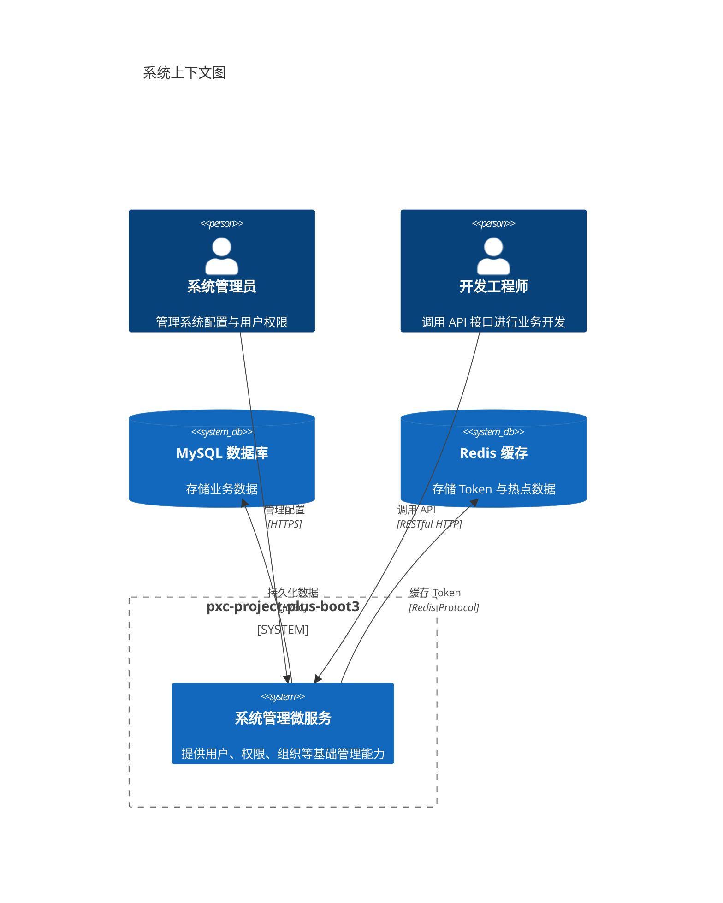
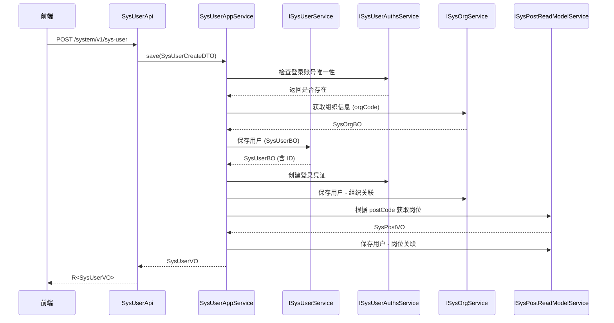

# 01-项目概述

> pxc-project-plus-boot3 - 基于 Spring Boot 3.x 的通用系统管理微服务项目

---

## 1.1 业务背景

本项目是一个**企业级通用系统管理微服务**，提供标准化的用户管理、权限控制、组织架构、字典管理等基础能力，可作为多租户 SaaS 系统的底层支撑平台。

**核心价值：**
- 统一的权限认证与授权体系（Sa-Token + JWT）
- 多租户隔离与数据权限控制
- 可扩展的组织架构与岗位管理体系
- 完善的操作日志与登录日志追踪
- 代码生成器支持快速业务开发

---

## 1.2 系统边界

### 系统上下文图



### 边界说明

| 边界类型 | 描述 |
|---------|------|
| **包含** | 用户管理、角色权限、组织架构、字典参数、日志审计、定时任务、多租户管理 |
| **不包含** | 业务领域逻辑（如订单、商品等）、前端 UI 实现、消息队列、分布式事务 |

---

## 1.3 核心架构原则

### 1.3.1 分层架构

项目采用 **DDD 思想的分层架构**：

```
application/  → 应用层（API 接口、AppService）
    ↓
domain/       → 领域层（BO 业务对象、Repository 接口）
    ↓
infrastructure/ → 基础设施层（DAO、Mapper、PO、Converter）
```

**代码示例：** `pxc-biz/pxc-biz-system/src/main/java/io/github/panxiaochao/project/system/`

```
├── application/           # 应用层
│   ├── api/              # REST API 控制器
│   │   ├── SysUserApi.java
│   │   ├── SysRoleApi.java
│   │   └── ...
│   ├── service/          # 应用服务
│   │   └── SysUserAppService.java
│   ├── repository/       # 读模型接口
│   │   └── ISysUserReadModelService.java
│   └── convert/          # DTO 转换器
│       └── ISysUserDTOConvert.java
│
├── domain/               # 领域层
│   ├── entity/           # 业务对象 (BO)
│   │   └── sysuser/SysUserBO.java
│   └── repository/       # 领域服务接口
│       └── ISysUserService.java
│
└── infrastructure/       # 基础设施层
    ├── dao/              # 数据访问对象
    │   ├── impl/         # Service 实现
    │   ├── mapper/       # MyBatis Mapper
    │   └── po/           # 持久化对象 (PO)
    └── convert/          # PO 转换器
```

### 1.3.2 CQRS 读写分离

项目采用 **命令查询职责分离 (CQRS)** 模式：

- **写模型**：通过 `domain/repository` 接口处理增删改操作
- **读模型**：通过 `application/repository` 接口处理复杂查询

**代码示例：**

```java
// 写模型接口 - domain/repository/ISysUserService.java
public interface ISysUserService {
    SysUserBO save(SysUserBO sysUser);
    void deleteByIds(List<Integer> idList);
}

// 读模型接口 - application/repository/ISysUserReadModelService.java
public interface ISysUserReadModelService {
    List<SysUserQueryVO> page(Pagination pagination, SysUserPageQueryDTO pageQueryDTO);
    SysUserVO getUserRelPostById(Integer id);
}
```

---

## 1.4 核心业务术语表

| 术语 | 英文 | 说明 | 对应表 |
|------|------|------|--------|
| 用户 | SysUser | 系统登录主体 | `sys_user` |
| 用户授权 | SysUserAuths | 用户登录凭证（账号密码、第三方等） | `sys_user_auths` |
| 角色 | SysRole | 权限集合 | `sys_role` |
| 菜单 | SysMenu | 系统功能菜单/按钮权限 | `sys_menu` |
| 岗位 | SysPost | 用户职务岗位 | `sys_post` |
| 组织 | SysOrg | 机构/部门树形结构 | `sys_org` |
| 租户 | SysTenant | 多租户隔离单元 | `sys_tenant` |
| 租户套餐 | SysTenantPackage | 租户可选功能包 | `sys_tenant_package` |
| 字典 | SysDict | 数据字典分类 | `sys_dict` |
| 字典项 | SysDictItem | 字典具体值 | `sys_dict_item` |
| 系统参数 | SysParam | 系统配置参数 | `sys_param` |
| 登录日志 | SysLogLogin | 用户登录记录 | `sys_log_login` |
| 操作日志 | SysLogOperate | 用户操作记录 | `sys_log_operate` |
| 定时任务 | SysJob | 调度任务配置 | `sys_job` |
| 区域 | SysArea | 行政区划 | `sys_area` |

---

## 1.5 关键业务流程

### 1.5.1 用户创建流程



**代码位置：** `pxc-biz/pxc-biz-system/src/main/java/io/github/panxiaochao/project/system/application/service/SysUserAppService.java:138-191`

---

## 1.6 系统特性

| 特性 | 实现方式 |
|------|---------|
| **认证授权** | Sa-Token + JWT，支持多端登录 |
| **多租户** | 租户 ID 隔离，支持租户套餐功能包 |
| **数据权限** | 基于角色 + 菜单 + 数据范围 |
| **缓存** | Redis + Caffeine 二级缓存 |
| **日志审计** | 登录日志 + 操作日志 |
| **代码生成** | Freemarker 模板生成 CRUD 代码 |
| **API 文档** | SpringDoc OpenAPI 3 + Knife4j |
| **跨域支持** | 框架内置 CORS 配置 |

---

## 1.7 部署形态

- **单体应用**：当前为单体部署模式
- **可微服务化**：模块化设计支持拆分为独立微服务
- **容器化**：支持 Docker 容器部署

---

## 1.8 参考文档

- [Spring Boot 官方文档](https://spring.io/projects/spring-boot)
- [Sa-Token 官方文档](https://sa-token.cc)
- [MyBatis-Plus 官方文档](https://baomidou.com)
- [SpringDoc OpenAPI](https://springdoc.org)
