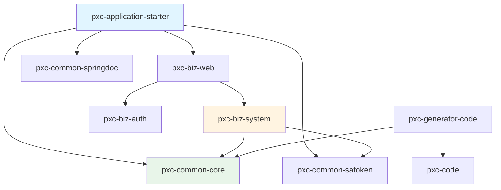

# 03-技术栈与依赖

> 核心技术选型与第三方依赖清单

---

## 3.1 语言与框架版本

| 类别 | 技术 | 版本 | 说明 |
|------|------|------|------|
| **开发语言** | Java | 17 | LTS 长期支持版本 |
| **核心框架** | Spring Boot | 3.5.11 | 应用框架基石 |
| **Web 框架** | Spring MVC | 6.2.16 | RESTful API 支持 |
| **ORM 框架** | MyBatis-Plus | 3.5.15 | 数据持久化 |
| **认证框架** | Sa-Token | 1.45.0 | 权限认证授权 |
| **API 文档** | SpringDoc OpenAPI | 2.8.16 | OpenAPI 3 规范 |
| **API 文档 UI** | Knife4j | 4.6.0 | 增强文档界面 |

---

## 3.2 数据库与缓存

| 类别 | 技术 | 版本 | 说明 |
|------|------|------|------|
| **关系数据库** | MySQL | 9.6.0 | 业务数据存储 |
| **连接池** | HikariCP | 内置 | Spring Boot 默认 |
| **缓存** | Redis | 7.x | Token 与热点数据 |
| **本地缓存** | Caffeine | 3.2.3 | 二级缓存 |

**HikariCP 连接池配置：**

```yaml
spring:
  datasource:
    hikari:
      minimum-idle: 5           # 最小空闲连接
      maximum-pool-size: 10     # 最大连接数
      idle-timeout: 600000      # 空闲超时 10 分钟
      max-lifetime: 1800000     # 最大生命周期 30 分钟
      connection-timeout: 30000 # 连接超时 30 秒
      pool-name: project-system-pool
```

---

## 3.3 核心第三方依赖

### 3.3.1 工具类库

| 依赖 | 版本 | 用途 |
|------|------|------|
| Hutool | 5.8.43 | Java 工具类集合 |
| Lombok | 1.18.42 | 简化代码编写 |
| MapStruct | 1.6.3 | 对象映射转换 |
| Caffeine | 3.2.3 | 高性能本地缓存 |
| Commons Pool2 | 2.12.0 | Redis 连接池 |

### 3.3.2 模板引擎

| 依赖 | 版本 | 用途 |
|------|------|------|
| FreeMarker | 2.3.34 | 代码生成模板 |

### 3.3.3 日志框架

| 依赖 | 版本 | 用途 |
|------|------|------|
| Logback | 1.5.32 | 日志实现 |

---

## 3.4 Sa-Token 认证框架详解

### 3.4.1 核心功能

| 功能 | 说明 |
|------|------|
| **登录认证** | 用户名密码、Token 认证 |
| **权限认证** | 角色权限、按钮权限 |
| **Session 管理** | 会话管理、踢人下线 |
| **JWT 支持** | 无状态 Token 认证 |
| **Redis 集成** | Token 分布式存储 |
| **多端登录** | PC、APP 等设备区分 |

### 3.4.2 配置参数

```yaml
sa-token:
  jwt-secret-key: pxc-system-cloud    # JWT 秘钥（生产环境需修改）
  token-name: Authorization            # Token 名称
  timeout: 7200                        # Token 有效期 2 小时
  active-timeout: -1                   # 不限制活跃频率
  is-concurrent: true                  # 允许同一账号多地登录
  is-share: false                      # 不共享 Token
  token-style: random-64               # 64 位随机字符串
  is-log: false                        # 不打印操作日志
  is-read-header: true                 # 从 Header 读取 Token
  is-read-cookie: false                # 不从 Cookie 读取
  token-prefix: Bearer                 # Token 前缀
```

### 3.4.3 白名单配置

```yaml
sa-token-plus:
  white-urls:
    - /web/v1/**           # Web 公开接口
    - /system/v1/**        # 系统接口（需配合其他鉴权）
    - /development/v1/**   # 开发接口
```

---

## 3.5 MyBatis-Plus 配置

### 3.5.1 核心配置

```yaml
mybatis-plus:
  db-type: mysql                 # 数据库类型
  sql-log-trace: true            # 开启 SQL 日志追踪
  global-config:
    banner: false                # 关闭启动 Banner
  configuration:
    map-underscore-to-camel-case: true  # 下划线转驼峰
    log-impl: org.apache.ibatis.logging.slf4j.Slf4jImpl  # SQL 日志
```

### 3.5.2 扩展功能

- **分页插件**：`PaginationInnerInterceptor`
- **逻辑删除**：`FillConfig` + `@TableLogic`
- **自动填充**：创建时间、更新时间自动设置
- **多租户**：`TenantLineInnerInterceptor`

---

## 3.6 SpringDoc OpenAPI 配置

### 3.6.1 文档访问地址

| 文档类型 | 地址 |
|---------|------|
| Knife4j | http://localhost:8081/doc.html |
| Swagger UI | http://localhost:8081/swagger-ui.html |
| OpenAPI JSON | http://localhost:8081/v3/api-docs |

### 3.6.2 注解使用

```java
@Tag(name = "系统管理 - 用户表 接口", description = "系统管理 - 用户表 Api 接口")
@RestController
@RequestMapping("/system/v1/sys-user")
public class SysUserApi {
    
    @Operation(summary = "查询分页", description = "查询分页")
    @PostMapping(value = "/page")
    public R<PageResponse<SysUserQueryVO>> page(@RequestBody SysUserPageQueryDTO pageQueryDTO) {
        // ...
    }
    
    @Parameter(name = "id", description = "系统管理 - 用户表 ID")
    @GetMapping(value = "/get")
    public R<SysUserVO> getById(@RequestParam Integer id) {
        // ...
    }
}
```

---

## 3.7 项目依赖结构

### 3.7.1 BOM 依赖管理

项目采用 **BOM (Bill of Materials)** 模式管理依赖版本：

```
pxc-project-plus-boot3 (根 POM)
├── pxc-framework-boot3-bom      # 框架 BOM（第三方）
├── pxc-common-bom               # 公共模块 BOM
└── pxc-biz-bom                  # 业务模块 BOM
```

### 3.7.2 模块依赖关系



---

## 3.8 编译插件

| 插件 | 版本 | 用途 |
|------|------|------|
| maven-compiler-plugin | 3.15.0 | Java 编译 |
| flatten-maven-plugin | 1.7.3 | 统一版本号处理 |
| spring-javaformat-maven-plugin | 0.0.47 | 代码格式验证 |

**编译配置：**

```xml
<plugin>
    <groupId>org.apache.maven.plugins</groupId>
    <artifactId>maven-compiler-plugin</artifactId>
    <configuration>
        <parameters>true</parameters>
        <source>17</source>
        <target>17</target>
        <annotationProcessorPaths>
            <path>
                <groupId>org.projectlombok</groupId>
                <artifactId>lombok</artifactId>
                <version>1.18.42</version>
            </path>
            <path>
                <groupId>org.mapstruct</groupId>
                <artifactId>mapstruct-processor</artifactId>
                <version>1.6.3</version>
            </path>
        </annotationProcessorPaths>
    </configuration>
</plugin>
```

---

## 3.9 技术选型理由

### 3.9.1 为什么选择 Spring Boot 3.x

| 优势 | 说明 |
|------|------|
| **JDK 17 支持** | 利用 Record、Pattern Matching 等新特性 |
| **Spring 6.2** | 基于 Jakarta EE 10，更好的云原生支持 |
| **AOT 编译** | 支持 GraalVM 原生镜像（未来规划） |
| **长期支持** | Spring Boot 3.x 支持至 2027+ |

### 3.9.2 为什么选择 Sa-Token

| 对比项 | Sa-Token | Spring Security |
|--------|----------|----------------|
| **学习成本** | 低，文档友好 | 高，配置复杂 |
| **功能完整性** | 登录、权限、Session、JWT | 完整但复杂 |
| **集成难度** | 简单，几行配置 | 需要大量配置 |
| **中文文档** | 完善 | 较少 |

### 3.9.3 为什么选择 MyBatis-Plus

| 优势 | 说明 |
|------|------|
| **零侵入** | 基于 MyBatis，无缝衔接 |
| **CRUD 增强** | 内置通用 Mapper，减少重复代码 |
| **分页插件** | 开箱即用的分页功能 |
| **代码生成器** | 快速生成实体、Mapper、Service |

---

## 3.10 完整依赖清单

### 3.10.1 pxc-biz-system 依赖

```xml
<dependencies>
    <!-- 框架依赖 -->
    <dependency>
        <groupId>io.github.panxiaochao</groupId>
        <artifactId>pxc-common-core</artifactId>
    </dependency>
    <dependency>
        <groupId>io.github.panxiaochao</groupId>
        <artifactId>pxc-common-satoken</artifactId>
    </dependency>
    <dependency>
        <groupId>io.github.panxiaochao</groupId>
        <artifactId>pxc-common-springdoc</artifactId>
    </dependency>
    
    <!-- MyBatis-Plus -->
    <dependency>
        <groupId>com.baomidou</groupId>
        <artifactId>mybatis-plus-spring-boot3-starter</artifactId>
    </dependency>
    
    <!-- MySQL 驱动 -->
    <dependency>
        <groupId>com.mysql</groupId>
        <artifactId>mysql-connector-j</artifactId>
    </dependency>
    
    <!-- MapStruct -->
    <dependency>
        <groupId>org.mapstruct</groupId>
        <artifactId>mapstruct</artifactId>
    </dependency>
    <dependency>
        <groupId>org.mapstruct</groupId>
        <artifactId>mapstruct-processor</artifactId>
        <scope>provided</scope>
    </dependency>
    
    <!-- Lombok -->
    <dependency>
        <groupId>org.projectlombok</groupId>
        <artifactId>lombok</artifactId>
        <scope>provided</scope>
    </dependency>
</dependencies>
```

---

## 3.11 版本更新建议

| 依赖 | 当前版本 | 建议版本 | 说明 |
|------|---------|---------|------|
| Spring Boot | 3.5.11 | 3.5.x 最新 | 保持小版本同步 |
| MyBatis-Plus | 3.5.15 | 3.5.x 最新 | 关注 bug 修复 |
| Sa-Token | 1.45.0 | 1.45.x 最新 | 安全更新 |
| MySQL Driver | 9.6.0 | 9.x 最新 | 性能优化 |

---

## 3.12 参考文档

- [Spring Boot 官方文档](https://docs.spring.io/spring-boot/docs/current/reference/html/)
- [Sa-Token 官方文档](https://sa-token.cc/doc.html)
- [MyBatis-Plus 官方文档](https://baomidou.com/pages/223848/)
- [SpringDoc OpenAPI](https://springdoc.org)
- [MapStruct Documentation](https://mapstruct.org/documentation/stable/)
