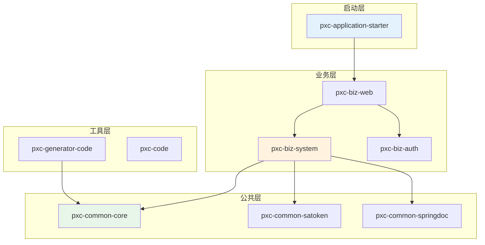
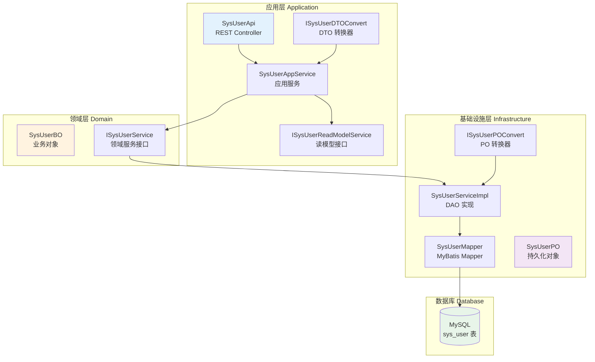
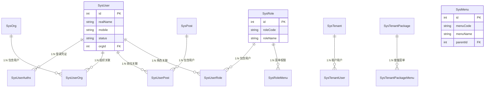
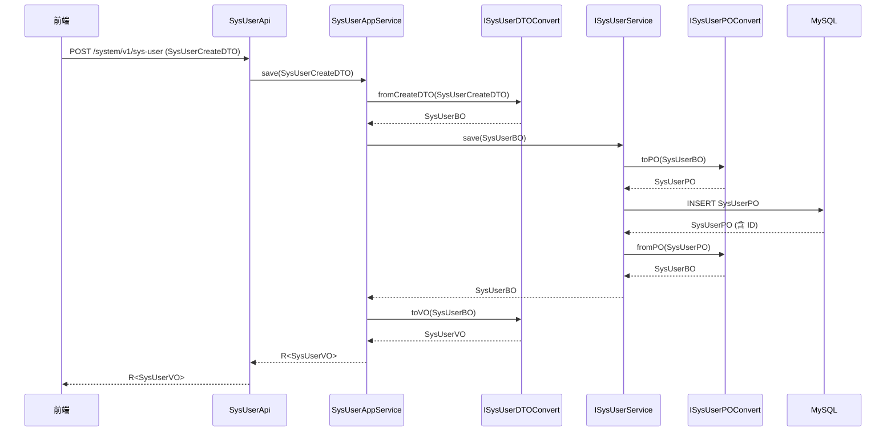

# 04-目录结构与模块划分

> 项目分层架构与模块职责详解

---

## 4.1 整体项目结构

```
pxc-project-plus-boot3/
├── pxc-application-starter/          # 应用启动入口模块
│   ├── src/main/
│   │   ├── java/.../ProjectSystemApplication.java
│   │   └── resources/
│   │       ├── application.yml       # 主配置文件
│   │       └── logback-spring.xml    # 日志配置
│   └── pom.xml
│
├── pxc-biz/                          # 业务模块
│   ├── pxc-biz-web/                  # Web 业务模块（统一 PC/APP）
│   │   ├── src/main/java/.../web/
│   │   │   └── config/rnnner/DictRunner.java
│   │   └── pom.xml
│   │
│   ├── pxc-biz-auth/                 # 认证授权模块
│   │   └── pom.xml
│   │
│   ├── pxc-biz-system/               # 系统管理模块（核心）
│   │   ├── src/main/java/.../system/
│   │   │   ├── application/          # 应用层
│   │   │   │   ├── api/              # REST API 控制器 (21 个)
│   │   │   │   ├── service/          # 应用服务
│   │   │   │   ├── repository/       # 读模型接口
│   │   │   │   └── convert/          # DTO 转换器
│   │   │   ├── domain/               # 领域层
│   │   │   │   ├── entity/           # 业务对象 (BO)
│   │   │   │   └── repository/       # 领域服务接口
│   │   │   └── infrastructure/       # 基础设施层
│   │   │       ├── dao/              # 数据访问
│   │   │       │   ├── impl/         # Service 实现
│   │   │       │   ├── mapper/       # MyBatis Mapper
│   │   │       │   └── po/           # 持久化对象
│   │   │       └── convert/          # PO 转换器
│   │   └── pom.xml
│   │
│   └── pxc-biz-bom/                  # 业务依赖管理
│       └── pom.xml
│
├── pxc-common/                       # 公共模块
│   ├── pxc-common-core/              # 公共核心
│   │   └── src/main/java/.../core/
│   │       └── constants/GlobalConstant.java
│   │   └── pom.xml
│   │
│   ├── pxc-common-satoken/           # Sa-Token 集成
│   │   └── src/main/java/.../satoken/
│   │       ├── config/               # 配置类
│   │       ├── core/                 # 核心实现
│   │       ├── handler/              # 异常处理
│   │       └── model/LoginUser.java
│   │   └── pom.xml
│   │
│   ├── pxc-common-springdoc/         # OpenAPI 文档
│   │   └── src/main/java/.../springdoc/
│   │       └── config/SpringDocAutoConfiguration.java
│   │   └── pom.xml
│   │
│   └── pxc-common-bom/               # 公共依赖管理
│       └── pom.xml
│
├── pxc-module/                       # 工具模块
│   ├── pxc-code/                     # 代码存放（生成输出）
│   └── pxc-generator-code/           # 代码生成器
│       ├── src/main/
│       └── src/test/java/.../PxcMybatisPlusGeneratorTest.java
│
├── pxc-application-starter/          # 启动模块
│   └── pom.xml
│
├── script.sql/                       # 数据库脚本
│   ├── pxc-system-20241010.sql.zip
│   ├── pxc-system-20241126.sql.zip
│   ├── pxc-system-20250425.sql.zip
│   └── pxc-system-plus-20260309.sql.zip
│
├── pom.xml                           # 根 POM（依赖管理 + 插件配置）
├── .gitignore
└── AGENTS.md
```

---

## 4.2 模块职责划分

### 4.2.1 模块依赖关系图



### 4.2.2 模块详细职责

| 模块 | 职责 | 关键类/文件 |
|------|------|------------|
| **pxc-application-starter** | 应用启动入口、配置加载 | `ProjectSystemApplication.java` |
| **pxc-biz-web** | 统一 PC/APP 业务逻辑、Web 配置 | `DictRunner.java` |
| **pxc-biz-system** | 系统管理核心功能（315+ Java 文件） | `SysUserAppService.java` |
| **pxc-biz-auth** | 认证授权逻辑（待扩展） | - |
| **pxc-common-core** | 全局常量、通用工具 | `GlobalConstant.java` |
| **pxc-common-satoken** | Sa-Token 集成配置 | `SaTokenWebConfigurer.java` |
| **pxc-common-springdoc** | OpenAPI 文档配置 | `SpringDocAutoConfiguration.java` |
| **pxc-generator-code** | 代码生成器 | `PxcMybatisPlusGeneratorTest.java` |
| **pxc-code** | 生成代码输出目录 | - |

---

## 4.3 系统模块分层架构

### 4.3.1 分层架构图



### 4.3.2 各层职责详解

#### 应用层 (application/)

**职责：** 处理外部请求，编排业务流程，不包含业务规则

| 子目录 | 职责 | 示例文件 |
|--------|------|---------|
| `api/` | REST API 控制器，接收 HTTP 请求 | `SysUserApi.java` |
| `service/` | 应用服务，编排业务逻辑 | `SysUserAppService.java` |
| `repository/` | 读模型接口，复杂查询 | `ISysUserReadModelService.java` |
| `convert/` | DTO ↔ BO 转换器 | `ISysUserDTOConvert.java` |

**代码示例：** `SysUserApi.java:33-48`

```java
@Tag(name = "系统管理 - 用户表 接口", description = "系统管理 - 用户表 Api 接口")
@RequiredArgsConstructor
@RestController
@RequestMapping("/system/v1/sys-user")
public class SysUserApi {

    private final SysUserAppService sysUserAppService;

    @Operation(summary = "查询分页", description = "查询分页")
    @PostMapping(value = "/page")
    public R<PageResponse<SysUserQueryVO>> page(@RequestBody SysUserPageQueryDTO pageQueryDTO) {
        return R.ok(sysUserAppService.page(pageQueryDTO));
    }
}
```

---

#### 领域层 (domain/)

**职责：** 核心业务逻辑与规则，领域模型定义

| 子目录 | 职责 | 示例文件 |
|--------|------|---------|
| `entity/` | 业务对象 (BO)，包含业务规则 | `SysUserBO.java` |
| `repository/` | 领域服务接口定义 | `ISysUserService.java` |

**代码示例：** `SysUserBO.java:17-142`

```java
@Getter
@Setter
@ToString
public class SysUserBO {
    private Integer id;
    private String realName;
    private String nickName;
    private String mobile;
    private String status;
    // ... 业务字段
}
```

---

#### 基础设施层 (infrastructure/)

**职责：** 技术实现细节，数据持久化、外部系统调用

| 子目录 | 职责 | 示例文件 |
|--------|------|---------|
| `dao/impl/` | Service 实现类 | `SysUserServiceImpl.java` |
| `dao/mapper/` | MyBatis Mapper 接口 | `SysUserMapper.java` |
| `dao/po/` | 持久化对象 | `SysUserPO.java` |
| `convert/` | PO ↔ BO 转换器 | `ISysUserPOConvert.java` |

**代码示例：** `SysUserServiceImpl.java:36-52`

```java
@Service
@RequiredArgsConstructor
public class SysUserServiceImpl implements ISysUserService, ISysUserReadModelService {

    private final SysUserMapper sysUserMapper;

    @Override
    public List<SysUserQueryVO> page(Pagination pagination, SysUserPageQueryDTO pageQueryDTO) {
        MPJLambdaWrapper<SysUserPO> wrapper = new MPJLambdaWrapper<>();
        wrapper.selectAll(SysUserPO.class)
            .selectAs(SysPostPO::getPostCode, SysUserQueryVO::getPostCode)
            .leftJoin(SysUserPostPO.class, SysUserPostPO::getUserId, SysUserPO::getId)
            .leftJoin(SysPostPO.class, SysPostPO::getId, SysUserPostPO::getPostId);
        // ...
    }
}
```

---

## 4.4 DDD 领域划分

### 4.4.1 核心领域

| 领域 | 说明 | 涉及表 |
|------|------|--------|
| **用户域** | 用户基本信息、登录凭证 | `sys_user`, `sys_user_auths` |
| **权限域** | 角色、菜单、权限控制 | `sys_role`, `sys_menu`, `sys_role_menu` |
| **组织域** | 部门、岗位、组织架构 | `sys_org`, `sys_post`, `sys_user_post`, `sys_user_org` |
| **租户域** | 多租户隔离、套餐管理 | `sys_tenant`, `sys_tenant_package`, `sys_tenant_user` |
| **日志域** | 登录日志、操作日志 | `sys_log_login`, `sys_log_operate` |
| **基础域** | 字典、参数、区域 | `sys_dict`, `sys_dict_item`, `sys_param`, `sys_area` |
| **任务域** | 定时任务调度 | `sys_job` |

### 4.4.2 领域对象关系图



---

## 4.5 请求 - 响应数据流

### 4.5.1 数据对象转换流程



### 4.5.2 对象类型说明

| 对象类型 | 后缀 | 用途 | 位置 |
|---------|------|------|------|
| **DTO** | `*DTO` | 数据传输对象（请求） | `application/api/dto/` |
| **VO** | `*VO` | 视图对象（响应） | `application/api/vo/` |
| **BO** | `*BO` | 业务对象（领域层） | `domain/entity/` |
| **PO** | `*PO` | 持久化对象（数据库） | `infrastructure/dao/po/` |

---

## 4.6 核心模块文件统计

### 4.6.1 pxc-biz-system 模块

| 类型 | 数量 | 说明 |
|------|------|------|
| **API 控制器** | 21 | 用户、角色、菜单等 REST 接口 |
| **应用服务** | 20+ | 对应各业务的应用服务 |
| **读模型接口** | 21 | CQRS 读模型 |
| **领域服务接口** | 21 | 领域层服务定义 |
| **业务对象 (BO)** | 21 | 领域实体 |
| **持久化对象 (PO)** | 21 | 数据库映射对象 |
| **Mapper 接口** | 21 | MyBatis Mapper |
| **DTO 转换器** | 20+ | MapStruct 转换器 |
| **总 Java 文件** | 315+ | 核心业务模块 |

### 4.6.2 目录深度分析

```
pxc-biz-system/src/main/java/io/github/panxiaochao/project/system/
├── application/          # 85 个子目录，应用层
│   ├── api/
│   │   ├── dto/         # 请求 DTO（按业务分类）
│   │   │   ├── sysuser/
│   │   │   ├── sysrole/
│   │   │   └── ...
│   │   ├── vo/          # 响应 VO（按业务分类）
│   │   │   ├── sysuser/
│   │   │   └── ...
│   │   ├── SysUserApi.java
│   │   └── ... (21 个 API)
│   ├── service/         # 应用服务
│   ├── repository/      # 读模型接口
│   └── convert/         # DTO 转换器
├── domain/              # 领域层
│   ├── entity/          # BO 实体（按业务分类）
│   └── repository/      # 领域服务接口
└── infrastructure/      # 基础设施层
    ├── dao/
    │   ├── impl/        # Service 实现
    │   ├── mapper/      # MyBatis Mapper
    │   └── po/          # PO 实体
    └── convert/         # PO 转换器
```

---

## 4.7 命名规范

### 4.7.1 包命名

```
io.github.panxiaochao.project.[模块名].[分层].[子层]
├── system               # 系统模块
├── application          # 应用层
├── domain               # 领域层
└── infrastructure       # 基础设施层
```

### 4.7.2 类命名

| 类型 | 命名规则 | 示例 |
|------|---------|------|
| API 控制器 | `*Api` | `SysUserApi` |
| 应用服务 | `*AppService` | `SysUserAppService` |
| 领域服务 | `I*Service` | `ISysUserService` |
| 读模型 | `I*ReadModelService` | `ISysUserReadModelService` |
| 业务对象 | `*BO` | `SysUserBO` |
| 持久化对象 | `*PO` | `SysUserPO` |
| 请求 DTO | `*DTO` | `SysUserCreateDTO` |
| 响应 VO | `*VO` | `SysUserVO` |
| 转换器 | `I*Convert` | `ISysUserDTOConvert` |
| Mapper | `*Mapper` | `SysUserMapper` |

---

## 4.8 模块扩展指南

### 4.8.1 新增业务模块步骤

1. **在 `pxc-biz` 下创建新模块目录**
2. **创建 `pom.xml`，引入必要依赖**
3. **在 `application/api/dto/` 创建 DTO 类**
4. **在 `application/api/vo/` 创建 VO 类**
5. **在 `application/api/` 创建 API 控制器**
6. **在 `application/service/` 创建应用服务**
7. **在 `domain/entity/` 创建 BO 实体**
8. **在 `domain/repository/` 创建领域服务接口**
9. **在 `infrastructure/dao/po/` 创建 PO 实体**
10. **在 `infrastructure/dao/mapper/` 创建 Mapper 接口**
11. **在 `infrastructure/dao/impl/` 创建 Service 实现**
12. **在 `application/convert/` 和 `infrastructure/convert/` 创建转换器**

### 4.8.2 使用代码生成器

```bash
# 运行代码生成器测试
cd pxc-module/pxc-generator-code
mvn test -Dtest=PxcMybatisPlusGeneratorTest
```

生成配置示例：

```java
PxcMybatisPlusGeneratorTools.builder()
    .jdbcUrl("jdbc:mysql://127.0.0.1:3308/pxc-system-plus")
    .username("root")
    .password("root123")
    .outputDir("/Users/lypxc/Documents/project_my/pxc-project-plus-boot3/pxc-module/pxc-code")
    .parent("io.github.panxiaochao.project")
    .moduleName("system")
    .entityName("po")
    .insertFields("create_at", "create_by", "update_at", "update_by")
    .updateFields("update_at", "update_by")
    .logicDeleteColumnName("is_delete")
    .build();
```

---

## 4.9 架构设计原则

| 原则 | 说明 | 项目实践 |
|------|------|---------|
| **单一职责** | 每个类只负责一个功能 | API 只处理 HTTP，Service 编排业务 |
| **依赖倒置** | 依赖抽象不依赖实现 | 领域层定义接口，基础设施层实现 |
| **接口隔离** | 使用细粒度接口 | 读模型与写模型分离 |
| **开闭原则** | 对扩展开放，对修改封闭 | 通过新增类而非修改现有类 |
| **CQRS** | 命令查询职责分离 | `AppService` 写，`ReadModel` 读 |

---

## 4.10 参考文档

- [DDD 领域驱动设计](https://en.wikipedia.org/wiki/Domain-driven_design)
- [CQRS 模式](https://martinfowler.com/bliki/CQRS.html)
- [Spring Boot 官方文档 - 最佳实践](https://spring.io/guides/gs/spring-boot/)
