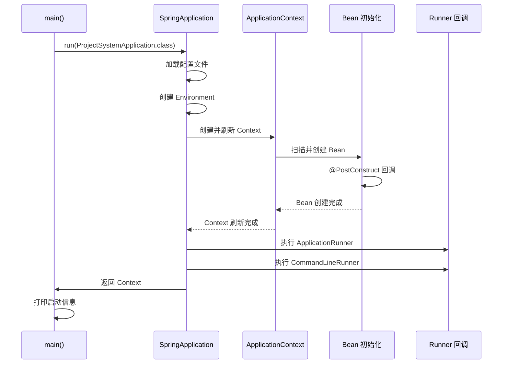

# 06-启动流程与配置管理

> 应用启动流程、配置加载机制与环境差异

---

## 6.1 应用入口

### 6.1.1 主启动类

**文件位置：** `pxc-application-starter/src/main/java/io/github/panxiaochao/project/ProjectSystemApplication.java`

```java
@SpringBootApplication
public class ProjectSystemApplication {

    private static final Logger LOG = LoggerFactory.getLogger(ProjectSystemApplication.class);

    public static void main(String[] args) {
        ConfigurableApplicationContext application = SpringApplication.run(ProjectSystemApplication.class, args);

        // 获取环境变量
        ApplicationInfo info = ApplicationInfo.build(application.getEnvironment());

        // 打印启动应用信息
        printApplicationInfo(info);
    }

    private static void printApplicationInfo(ApplicationInfo info) {
        String banner = "\n----------------------------------------------------------\n";
        banner += String.format("%s is running! Access URLs:\n", info.getApplicationName());
        banner += String.format("OS           系统信息：%s %s\n", info.getOsName(), info.getOsVersion());
        banner += String.format("Active       配置文件：%s\n", info.getActiveProfile());
        banner += String.format("JDK          版本信息：%s\n", JdkUtil.JVM_VERSION);
        banner += String.format("Local        访问网址：http://localhost:%s%s\n", info.getPort(), info.getPath());
        banner += String.format("External     访问网址：http://%s:%s%s\n", info.getIp(), info.getPort(), info.getPath());
        banner += String.format("Doc          访问网址：http://%s:%s%s/doc.html\n", info.getIp(), info.getPort(), info.getPath());
        LOG.info(banner);
    }
}
```

**启动流程：**
1. `SpringApplication.run()` - 启动 Spring 容器
2. `ApplicationInfo.build()` - 从 Environment 读取配置信息
3. `printApplicationInfo()` - 打印启动信息

---

## 6.2 配置加载顺序

### 6.2.1 配置优先级（从高到低）

```
1. 命令行参数 (--server.port=8082)
2. 来自 java:comp/env 的 JNDI 属性
3. Java 系统属性 (System.getProperties())
4. 操作系统环境变量
5. jar 包外部的 application-{profile}.properties/yml
6. jar 包内部的 application-{profile}.properties/yml
7. jar 包外部的 application.properties/yml
8. jar 包内部的 application.properties/yml (默认加载)
9. @Configuration 类上的 @PropertySource
10. 默认属性 (spring.main.sources 等)
```

### 6.2.2 配置文件结构

```
pxc-application-starter/src/main/resources/
├── application.yml           # 主配置文件（所有环境通用）
└── application-dev.yml       # 开发环境配置（可选）
```

---

## 6.3 核心配置项详解

### 6.3.1 Server 配置

```yaml
server:
  port: 8081                          # 服务端口
  servlet:
    context-path: /                   # 上下文路径
```

### 6.3.2 数据库配置

```yaml
spring:
  datasource:
    url: jdbc:mysql://localhost:3308/pxc-system-plus?rewriteBatchedStatements=true&useUnicode=true&characterEncoding=utf-8&useSSL=false&allowMultiQueries=true&serverTimezone=GMT%2B8&allowPublicKeyRetrieval=true
    username: root
    password: root123
    driver-class-name: com.mysql.cj.jdbc.Driver
    type: com.zaxxer.hikari.HikariDataSource
    hikari:
      minimum-idle: 5                 # 最小空闲连接数
      maximum-pool-size: 10           # 最大连接数
      idle-timeout: 600000            # 空闲连接超时时间 (10 分钟)
      max-lifetime: 1800000           # 连接最大生命周期 (30 分钟)
      connection-timeout: 30000       # 连接超时时间 (30 秒)
      pool-name: project-system-pool  # 连接池名称
```

**连接池参数说明：**

| 参数 | 默认值 | 推荐值 | 说明 |
|------|--------|--------|------|
| minimum-idle | 10 | 5 | 最小空闲连接 |
| maximum-pool-size | 10 | 10-50 | 根据并发量调整 |
| idle-timeout | 600000 | 600000 | 10 分钟 |
| max-lifetime | 1800000 | 1800000 | 30 分钟（比 MySQL wait_timeout 短） |
| connection-timeout | 30000 | 30000 | 30 秒 |

### 6.3.3 Redis 配置

```yaml
spring:
  data:
    redis:
      host: 127.0.0.1
      port: 6379
      database: 0
      # password: your_password     # 如需要密码
      # timeout: 5000               # 连接超时
      # lettuce:
      #   pool:
      #     max-active: 8           # 最大连接数
      #     max-idle: 8             # 最大空闲连接
      #     min-idle: 0             # 最小空闲连接
```

### 6.3.4 MyBatis-Plus 配置

```yaml
mybatis-plus:
  db-type: mysql                    # 数据库类型
  sql-log-trace: true               # 开启 SQL 日志追踪
  global-config:
    banner: false                   # 关闭 MP 启动 Banner
  configuration:
    map-underscore-to-camel-case: true  # 下划线转驼峰
    log-impl: org.apache.ibatis.logging.slf4j.Slf4jImpl  # SQL 日志实现
```

### 6.3.5 Sa-Token 配置

```yaml
sa-token:
  jwt-secret-key: pxc-system-cloud      # JWT 秘钥（生产环境必须修改）
  token-name: Authorization             # Token 名称
  timeout: 7200                         # Token 有效期 (2 小时)
  active-timeout: -1                    # 不限制活跃频率
  is-concurrent: true                   # 允许同一账号多地登录
  is-share: false                       # 不共享 Token
  token-style: random-64                # 64 位随机字符串
  is-log: false                         # 不打印操作日志
  is-read-header: true                  # 从 Header 读取 Token
  is-read-cookie: false                 # 不从 Cookie 读取
  token-prefix: Bearer                  # Token 前缀

# Sa-Token 扩展配置
sa-token-plus:
  white-urls:
    - /web/v1/**           # Web 公开接口
    - /system/v1/**        # 系统接口
    - /development/v1/**   # 开发接口
```

### 6.3.6 SpringDoc OpenAPI 配置

```yaml
springdoc:
  api-docs:
    enabled: true
  swagger-ui:
    enabled: true
  packages-to-scan: io.github.panxiaochao.project  # 扫描包路径
```

### 6.3.7 框架配置

```yaml
spring:
  # 允许 Bean 定义覆盖
  allow-bean-definition-overriding: true
  # 允许循环依赖
  allow-circular-references: true
  servlet:
    multipart:
      max-file-size: 50MB           # 单文件最大大小
      max-request-size: 50MB        # 请求最大大小

# pxc-framework 配置
pxc-framework-boot3:
  async: true                       # 开启异步
  cors:
    enabled: true                   # 开启跨域
  xss:
    enabled: false                  # XSS 防护（根据需求开启）
  cache:
    type: redis                     # 缓存类型：redis / caffeine
```

---

## 6.4 多环境配置

### 6.4.1 环境划分

| 环境 | Profile | 配置文件 | 说明 |
|------|---------|---------|------|
| 开发 | dev | application-dev.yml | 本地开发 |
| 测试 | test | application-test.yml | 测试环境 |
| 生产 | prod | application-prod.yml | 生产环境 |

### 6.4.2 环境差异配置示例

**application-dev.yml**
```yaml
spring:
  datasource:
    url: jdbc:mysql://localhost:3308/pxc-system-plus?...
    username: root
    password: root123
  redis:
    host: 127.0.0.1
    port: 6379

logging:
  level:
    io.github.panxiaochao.project: debug  # 开发环境打印 DEBUG 日志
```

**application-prod.yml**
```yaml
spring:
  datasource:
    url: jdbc:mysql://prod-db:3306/pxc-system-plus?...
    username: ${DB_USERNAME:prod_user}
    password: ${DB_PASSWORD:prod_password}
  redis:
    host: ${REDIS_HOST:prod-redis}
    port: ${REDIS_PORT:6379}
    password: ${REDIS_PASSWORD:}

server:
  port: 8080

logging:
  level:
    io.github.panxiaochao.project: warn   # 生产环境只打印 WARN 以上
```

### 6.4.3 激活环境

**方式一：配置文件**
```yaml
# application.yml
spring:
  profiles:
    active: dev
```

**方式二：命令行**
```bash
java -jar app.jar --spring.profiles.active=prod
```

**方式三：环境变量**
```bash
export SPRING_PROFILES_ACTIVE=prod
java -jar app.jar
```

---

## 6.5 Bean 初始化顺序

### 6.5.1 启动阶段

```
1. SpringApplication 初始化
   └── 加载配置文件
   └── 准备 Environment
   └── 创建 ApplicationContext

2. @Configuration 类加载
   └── 扫描 @Bean 定义
   └── 处理 @Import 导入

3. Bean 创建与依赖注入
   └── @Component 扫描
   └── @Autowired 注入
   └── @PostConstruct 回调

4. 启动完成
   └── ApplicationRunner 回调
   └── CommandLineRunner 回调
   └── 打印启动信息
```

### 6.5.2 启动时序图



### 6.5.3 Runner 示例

**文件位置：** `pxc-biz/pxc-biz-web/src/main/java/.../config/rnnner/DictRunner.java`

```java
@Component
public class DictRunner implements ApplicationRunner {
    
    @Autowired
    private ISysDictService dictService;
    
    @Override
    public void run(ApplicationArguments args) {
        // 启动时加载字典数据到缓存
        dictService.loadDictToCache();
    }
}
```

---

## 6.6 配置属性绑定

### 6.6.1 @ConfigurationProperties 示例

**文件位置：** `pxc-common/pxc-common-satoken/.../config/properties/SaTokenConfigPlus.java`

```java
@Data
@ConfigurationProperties(prefix = "sa-token-plus")
public class SaTokenConfigPlus {
    
    /**
     * 白名单 URL
     */
    private List<String> whiteUrls = new ArrayList<>();
}
```

**对应配置：**
```yaml
sa-token-plus:
  white-urls:
    - /web/v1/**
    - /system/v1/**
```

---

## 6.7 外部配置源

### 6.7.1 支持配置源

| 配置源 | 说明 | 优先级 |
|--------|------|--------|
| application.yml | 本地配置文件 | 低 |
| 环境变量 | `SPRING_DATASOURCE_URL` | 高 |
| 命令行参数 | `--server.port=8082` | 最高 |
| Nacos/Apollo | 配置中心（可选） | 可配置 |

### 6.7.2 环境变量映射

| YAML 配置 | 环境变量 |
|----------|---------|
| `server.port` | `SERVER_PORT` |
| `spring.datasource.url` | `SPRING_DATASOURCE_URL` |
| `spring.datasource.username` | `SPRING_DATASOURCE_USERNAME` |
| `sa-token.jwt-secret-key` | `SA_TOKEN_JWT_SECRET_KEY` |

---

## 6.8 配置校验

### 6.8.1 启动时校验

```java
@PostConstruct
public void validateConfig() {
    Assert.hasText(saTokenConfigPlus.getJwtSecretKey(), "JWT 秘钥不能为空");
    Assert.isTrue(datasourceUrl.contains("mysql"), "仅支持 MySQL 数据库");
}
```

---

## 6.9 常见问题

### 6.9.1 配置不生效

**原因：** 配置优先级问题

**解决：** 检查配置来源优先级，使用更高优先级配置覆盖

### 6.9.2 多环境切换失败

**原因：** active profile 未正确设置

**解决：** 检查 `spring.profiles.active` 配置或命令行参数

### 6.9.3 敏感信息泄露

**建议：**
1. 生产环境使用环境变量
2. 使用配置中心加密
3. 不要将密码提交到 Git

---

## 6.10 参考文档

- [Spring Boot 官方配置文档](https://docs.spring.io/spring-boot/docs/current/reference/html/features.html#features.external-config)
- [MyBatis-Plus 配置文档](https://baomidou.com/pages/984266/)
- [Sa-Token 配置文档](https://sa-token.cc/doc.html)
