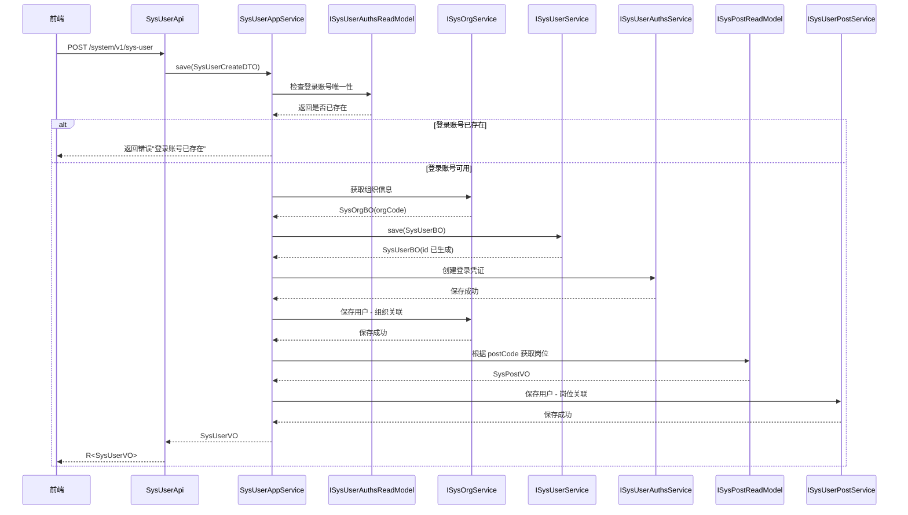
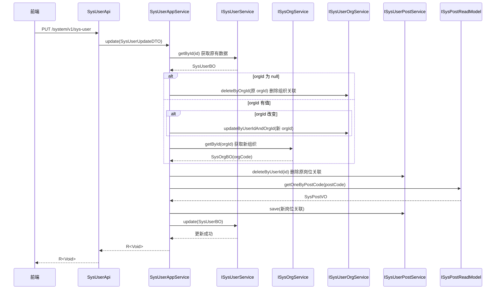
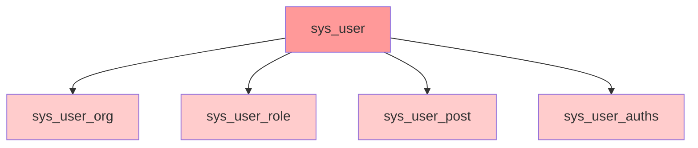
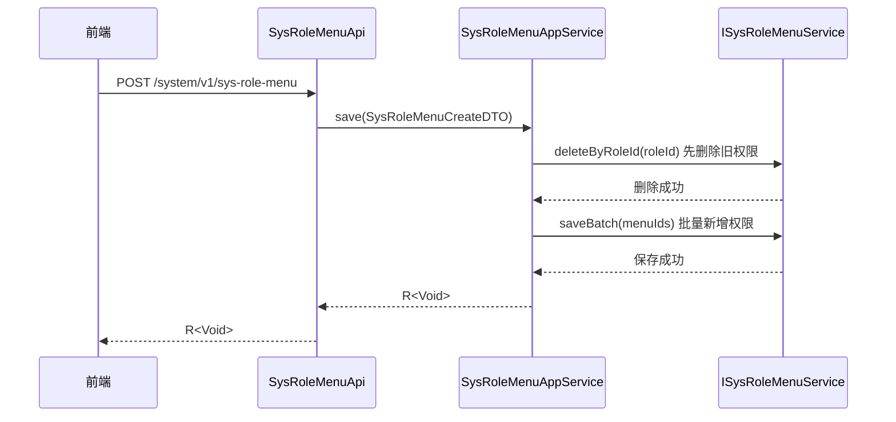
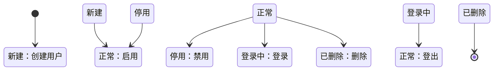

# 09-业务逻辑层分析

> Service 层职责划分、核心业务时序图与领域模型生命周期

---

## 9.1 分层架构回顾

```
application/  → 应用层（API 接口、AppService、ReadModel）
    ↓
domain/       → 领域层（BO、Domain Service、Repository 接口）
    ↓
infrastructure/ → 基础设施层（DAO、Mapper、PO、Converter）
```

---

## 9.2 应用服务 (AppService)

### 9.2.1 职责说明

**应用服务层**负责：
1. 接收 DTO 请求参数
2. 参数校验与业务规则检查
3. 调用领域层完成业务逻辑
4. 编排多个领域操作的顺序
5. 转换 BO 为 VO 返回给调用方

**不包含：**
- 核心业务规则（应在 Domain 层）
- 数据持久化细节（应在 Infrastructure 层）

---

## 9.3 核心业务分析

### 9.3.1 用户创建流程

**代码位置：** `SysUserAppService.java:138-191`

#### 9.3.1.1 时序图



#### 9.3.1.2 关键业务规则

1. **登录账号唯一性**：同一 identity_type + identifier 不能重复
2. **默认密码**：如未提供密码，从系统参数 `sys.user.password` 读取
3. **组织关联**：创建用户时自动关联组织
4. **岗位关联**：创建用户时可选关联岗位
5. **密码过期时间**：默认设置为 `2099-12-31 23:59:59`

#### 9.3.1.3 代码片段

```java
public R<SysUserVO> save(SysUserCreateDTO sysUserCreateDTO) {
    // 1. DTO 转 BO
    SysUserBO sysUser = ISysUserDTOConvert.INSTANCE.fromCreateDTO(sysUserCreateDTO);
    
    // 2. 检查登录账号唯一性
    SysUserAuthsPageQueryDTO queryRequest = new SysUserAuthsPageQueryDTO();
    queryRequest.setIdentifier(sysUserCreateDTO.getLoginName());
    queryRequest.setIdentityType("USERNAME");
    SysUserAuthsVO one = sysUserAuthsReadModelService.getOne(queryRequest);
    if (Objects.nonNull(one)) {
        return R.fail("登录账号 [" + sysUserCreateDTO.getLoginName() + "] 已存在");
    }
    
    // 3. 获取组织信息
    if (sysUser.getOrgId() != null) {
        SysOrgBO sysOrg = sysOrgService.getById(sysUser.getOrgId());
        sysUser.setOrgCode(sysOrg.getOrgCode());
    }
    
    // 4. 保存用户
    sysUser = sysUserService.save(sysUser);
    
    // 5. 初始化密码
    SysUserAuthsBO sysUserAuthsBO = new SysUserAuthsBO();
    sysUserAuthsBO.setUserId(sysUser.getId());
    sysUserAuthsBO.setIdentityType("USERNAME");
    sysUserAuthsBO.setIdentifier(sysUserCreateDTO.getLoginName());
    sysUserAuthsBO.setCredential(sysUserCreateDTO.getPassword());
    sysUserAuthsBO.setExpireAt(LocalDateTimeUtil.stringToLocalDateTime("2099-12-31 23:59:59"));
    sysUserAuthsAppService.save(sysUserAuthsBO);
    
    // 6. 保存组织关联
    if (sysUser.getOrgId() != null) {
        SysUserOrgBO sysUserOrg = new SysUserOrgBO();
        sysUserOrg.setUserId(sysUser.getId());
        sysUserOrg.setOrgId(sysUser.getOrgId());
        sysUserOrgService.save(sysUserOrg);
    }
    
    // 7. 保存岗位关联
    if (StringUtils.hasText(sysUserCreateDTO.getPostCode())) {
        SysPostVO sysPostVO = sysPostReadModelService.getOneByPostCode(sysUserCreateDTO.getPostCode());
        SysUserPostBO sysUserPost = new SysUserPostBO();
        sysUserPost.setUserId(sysUser.getId());
        sysUserPost.setPostId(sysPostVO.getId());
        sysUserPostService.save(sysUserPost);
    }
    
    return R.ok(ISysUserDTOConvert.INSTANCE.toVO(sysUser));
}
```

---

### 9.3.2 用户更新流程

**代码位置：** `SysUserAppService.java:198-229`

#### 9.3.2.1 时序图



#### 9.3.2.2 关键逻辑

1. **组织变更处理**：
   - orgId 为 null：删除原组织关联
   - orgId 改变：更新组织关联
   - orgId 不变：无需操作

2. **岗位更新**：
   - 先删除原有岗位关联
   - 再添加新岗位关联

3. **组织编码同步**：
   - 更新时同步更新 orgCode

---

### 9.3.3 用户删除流程

**代码位置：** `SysUserAppService.java:230-268`

#### 9.3.3.1 删除顺序

删除用户时需要**级联删除**所有关联数据：

```java
public R<Void> deleteById(Integer id) {
    List<Integer> idList = List.of(id);
    
    // 1. 删除用户信息（主表）
    sysUserService.deleteByIds(idList);
    
    // 2. 删除组织关联
    sysUserOrgService.deleteByUserId(idList);
    
    // 3. 删除角色关联
    sysUserRoleService.deleteByUserId(idList);
    
    // 4. 删除岗位关联
    sysUserPostService.deleteByUserId(idList);
    
    // 5. 删除密码管理信息
    sysUserAuthsService.deleteByUserId(idList);
    
    return R.ok();
}
```

#### 9.3.3.2 删除依赖关系



**删除顺序必须遵循：**
1. 先删关联表（从表）
2. 后删主表

---

### 9.3.4 角色权限分配

**代码位置：** `SysRoleAppService.java`

#### 9.3.4.1 角色 - 菜单分配



#### 9.3.4.2 数据权限范围

| 值 | 说明 | 使用场景 |
|----|------|---------|
| 1 | 全部数据 | 超级管理员 |
| 2 | 自定义数据 | 特殊权限角色 |
| 3 | 本部门数据 | 部门负责人 |
| 4 | 本部门及以下 | 中层管理者 |
| 5 | 仅本人数据 | 普通员工 |

---

### 9.3.5 菜单树查询

**代码位置：** `SysMenuAppService.java`

#### 9.3.5.1 树形结构构建

```java
public List<SysMenuVO> getMenuTree() {
    // 1. 查询所有菜单
    List<SysMenuPO> allMenus = menuMapper.selectList(null);
    
    // 2. 过滤有效菜单
    List<SysMenuPO> validMenus = allMenus.stream()
        .filter(m -> "1".equals(m.getStatus()))
        .collect(Collectors.toList());
    
    // 3. 构建树形结构
    return buildMenuTree(validMenus, 0);
}

private List<SysMenuVO> buildMenuTree(List<SysMenuPO> menus, Integer parentId) {
    return menus.stream()
        .filter(m -> parentId.equals(m.getParentId()))
        .map(menu -> {
            SysMenuVO vo = convertToVO(menu);
            vo.setChildren(buildMenuTree(menus, menu.getId()));
            return vo;
        })
        .collect(Collectors.toList());
}
```

#### 9.3.5.2 树形结构示例

```json
[
  {
    "id": 3,
    "menuName": "系统设置",
    "children": [
      {
        "id": 4,
        "menuName": "用户管理",
        "children": [
          { "id": 6, "menuName": "用户新增", "menuType": "2" },
          { "id": 7, "menuName": "用户编辑", "menuType": "2" }
        ]
      },
      {
        "id": 11,
        "menuName": "角色管理",
        "children": []
      }
    ]
  }
]
```

---

## 9.4 领域对象生命周期

### 9.4.1 用户领域对象



### 9.4.2 状态流转规则

| 状态 | 可流转至 | 说明 |
|------|---------|------|
| 新建 | 正常、停用 | 创建后可直接启用或停用 |
| 正常 | 停用、登录中、已删除 | 正常状态可进行登录、停用、删除 |
| 停用 | 正常 | 停用的用户可重新启用 |
| 登录中 | 正常 | 登录状态非持久化 |
| 已删除 | - | 删除后不可恢复 |

---

## 9.5 事务管理

### 9.5.1 事务注解

```java
@Service
public class SysUserAppService {
    
    @Transactional(rollbackFor = Exception.class)
    public R<SysUserVO> save(SysUserCreateDTO dto) {
        // 业务逻辑
    }
    
    @Transactional(rollbackFor = Exception.class)
    public R<Void> deleteById(Integer id) {
        // 业务逻辑
    }
}
```

### 9.5.2 事务传播

| 场景 | 传播行为 | 说明 |
|------|---------|------|
| 用户创建 | REQUIRED | 默认，加入当前事务 |
| 用户删除 | REQUIRED | 默认，加入当前事务 |
| 权限分配 | REQUIRED | 默认，加入当前事务 |

---

## 9.6 业务规则汇总

### 9.6.1 用户管理

| 规则 | 说明 |
|------|------|
| 登录账号唯一性 | 同一 identity_type + identifier 唯一 |
| 密码长度 | 6-50 位 |
| 手机号格式 | 1 开头 11 位数字 |
| 组织关联 | 一个用户只能属于一个组织 |
| 岗位关联 | 一个用户只能有一个岗位 |
| 角色关联 | 一个用户可以有多个角色 |

### 9.6.2 角色管理

| 规则 | 说明 |
|------|------|
| 角色编码唯一 | role_code 全局唯一 |
| 超级管理员 | role_code = 'superAdmin' 不可删除 |
| 数据权限 | 5 种预定义范围 |

### 9.6.3 菜单管理

| 规则 | 说明 |
|------|------|
| 树形结构 | 无限层级，parent_id 为 0 为根节点 |
| 菜单类型 | 0-目录，1-菜单，2-按钮 |
| 状态控制 | status=1 有效，status=0 无效 |

---

## 9.7 业务异常处理

### 9.7.1 异常类型

| 异常 | 触发条件 | 返回码 |
|------|---------|--------|
| 账号已存在 | 登录账号重复 | 500 |
| 组织不存在 | orgId 无效 | 500 |
| 岗位不存在 | postCode 无效 | 500 |
| 角色被引用 | 删除被使用的角色 | 500 |
| 菜单被引用 | 删除被引用的菜单 | 500 |

### 9.7.2 异常处理

```java
@RequiredArgsConstructor
@RestController
@RequestMapping("/system/v1/sys-user")
public class SysUserApi {
    
    @PostMapping
    public R<SysUserVO> save(@RequestBody SysUserCreateDTO dto) {
        try {
            return sysUserAppService.save(dto);
        } catch (BusinessException e) {
            return R.fail(e.getMessage());
        }
    }
}
```

---

## 9.8 参考文档

- [DDD 领域驱动设计](https://en.wikipedia.org/wiki/Domain-driven_design)
- [Spring 事务管理](https://docs.spring.io/spring-framework/docs/current/reference/html/data-access.html#transaction)
