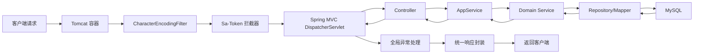
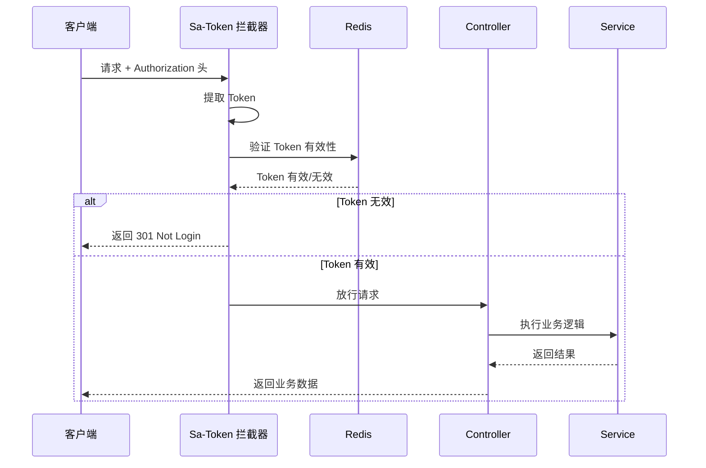

# 10-中间件与拦截器

> 请求处理链、过滤器顺序与统一 Context 传递

---

## 10.1 请求处理流程

### 10.1.1 请求生命周期



---

## 10.2 过滤器链

### 10.2.1 Spring Boot 默认过滤器

| 顺序 | 过滤器 | 作用 |
|------|--------|------|
| 1 | CharacterEncodingFilter | 设置请求编码为 UTF-8 |
| 2 | FormContentFilter | 解析表单请求体 |
| 3 | ... | Spring Boot 其他内置过滤器 |

### 10.2.2 项目自定义过滤器

当前项目**未自定义过滤器**，主要依赖拦截器实现认证逻辑。

---

## 10.3 拦截器配置

### 10.3.1 Sa-Token 拦截器

**配置类：** `SaTokenWebConfigurer.java`

**代码位置：** `pxc-common/pxc-common-satoken/.../SaTokenWebConfigurer.java:25-57`

```java
@AutoConfiguration
@RequiredArgsConstructor
@EnableConfigurationProperties(SaTokenConfigPlus.class)
public class SaTokenWebConfigurer implements WebMvcConfigurer {

    public static final String[] SWAGGER_EXCLUDE = {
        "/swagger-ui.html",
        "/swagger-ui/*",
        "/swagger-resources/**",
        "/*/api-docs",
        "/webjars/**",
        "/v2/**",
        "/v3/**",
        "/doc.html",
        "/static/**",
        "/favicon.ico"
    };

    @Override
    public void addInterceptors(InterceptorRegistry registry) {
        List<String> whitelist = saTokenConfigPlus.getWhiteUrls();
        whitelist.addAll(Arrays.asList(SWAGGER_EXCLUDE));
        
        // 注册 Sa-Token 拦截器，定义详细认证规则
        registry.addInterceptor(new SaInterceptor(handler -> SaRouter.match("/**").check(StpUtil::checkLogin)))
            .addPathPatterns("/**")
            .excludePathPatterns(whitelist);
    }
}
```

### 10.3.2 拦截器顺序

| 拦截器 | 优先级 | 作用域 | 认证规则 |
|--------|--------|--------|---------|
| Sa-Token 拦截器 | 高 | `/**` | 所有路径需登录 |
| 白名单 | - | 配置路径 | 无需登录 |

### 10.3.3 白名单配置

**配置文件：** `application.yml`

```yaml
sa-token-plus:
  white-urls:
    - /web/v1/**           # Web 公开接口
    - /system/v1/**        # 系统接口（需配合其他鉴权）
    - /development/v1/**   # 开发接口
```

**Swagger 白名单（硬编码）：**
```java
"/swagger-ui.html",
"/swagger-ui/*",
"/swagger-resources/**",
"/doc.html",
"/static/**",
"/favicon.ico"
```

---

## 10.4 认证流程

### 10.4.1 Token 验证流程



### 10.4.2 Token 传递方式

**请求头：**
```
Authorization: Bearer <token>
```

**配置：**
```yaml
sa-token:
  token-name: Authorization      # Token 名称
  token-prefix: Bearer           # Token 前缀
  is-read-header: true           # 从 Header 读取
  is-read-cookie: false          # 不从 Cookie 读取
```

---

## 10.5 权限注解

### 10.5.1 权限控制注解

| 注解 | 作用 | 示例 |
|------|------|------|
| `@SaCheckLogin` | 检查登录 | ```@SaCheckLogin``` |
| `@SaCheckRole` | 检查角色 | ```@SaCheckRole("admin")``` |
| `@SaCheckPermission` | 检查权限 | ```@SaCheckPermission("sys:user:add")``` |
| `@SaCheckRoleOr` | 角色任一 | ```@SaCheckRoleOr("admin", "user")``` |
| `@SaCheckPermissionOr` | 权限任一 | ```@SaCheckPermissionOr("a", "b")``` |

### 10.5.2 使用示例

```java
@SaCheckPermission("sys:user:add")
@PostMapping
public R<SysUserVO> save(@RequestBody SysUserCreateDTO dto) {
    return sysUserAppService.save(dto);
}

@SaCheckRole("admin")
@DeleteMapping("/delete")
public R<Void> delete(@RequestParam Integer id) {
    return sysUserAppService.deleteById(id);
}
```

---

## 10.6 跨域处理

### 10.6.1 CORS 配置

**配置文件：** `application.yml`

```yaml
pxc-framework-boot3:
  cors:
    enabled: true
```

### 10.6.2 跨域请求处理

Spring Boot 3.x 默认支持 CORS，通过配置启用：

```java
@Configuration
public class WebConfig implements WebMvcConfigurer {
    
    @Override
    public void addCorsMappings(CorsRegistry registry) {
        registry.addMapping("/**")
            .allowedOrigins("*")
            .allowedMethods("GET", "POST", "PUT", "DELETE", "OPTIONS")
            .allowedHeaders("*")
            .allowCredentials(true)
            .maxAge(3600);
    }
}
```

---

## 10.7 全局异常处理

### 10.7.1 Sa-Token 异常处理

**处理类：** `SaTokenExceptionHandler.java`

**代码位置：** `pxc-common/pxc-common-satoken/.../SaTokenExceptionHandler.java`

```java
@RestControllerAdvice
public class SaTokenExceptionHandler {
    
    /**
     * 拦截：未登录异常
     */
    @ExceptionHandler(NotLoginException.class)
    public R<Void> handleNotLoginException(NotLoginException e) {
        return R.fail(301, "未登录");
    }
    
    /**
     * 拦截：认证失败异常
     */
    @ExceptionHandler(SaException.class)
    public R<Void> handleSaException(SaException e) {
        return R.fail(e.getCode(), e.getMessage());
    }
}
```

### 10.7.2 统一异常处理

**异常类型：**

| 异常 | 返回码 | 消息 |
|------|--------|------|
| NotLoginException | 301 | 未登录 |
| NotRoleException | 401 | 缺少角色权限 |
| NotPermissionException | 401 | 缺少接口权限 |
| SaException | 500 | 认证失败 |

---

## 10.8 请求上下文

### 10.8.1 用户信息获取

**工具类：** `LoginHelper`

**代码位置：** `pxc-common/pxc-common-satoken/.../utils/LoginHelper.java`

```java
public class LoginHelper {
    
    /**
     * 获取当前登录用户 ID
     */
    public static Integer getUserId() {
        return StpUtil.getLoginIdDefaultNull();
    }
    
    /**
     * 获取当前登录用户信息
     */
    public static LoginUser getLoginUser() {
        return (LoginUser) StpUtil.getLoginDetails();
    }
}
```

### 10.8.2 使用示例

```java
@Service
public class SysUserAppService {
    
    public R<SysUserVO> getById(Integer id) {
        // 获取当前登录用户
        Integer currentUserId = LoginHelper.getUserId();
        
        // 业务逻辑
        SysUserVO user = sysUserReadModelService.getUserRelPostById(id);
        return R.ok(user);
    }
}
```

---

## 10.9 请求日志

### 10.9.1 日志记录

**日志配置：** `application.yml`

```yaml
mybatis-plus:
  configuration:
    log-impl: org.apache.ibatis.logging.slf4j.Slf4jImpl
```

### 10.9.2 SQL 日志输出

```
==>  Preparing: SELECT id, real_name, nick_name FROM sys_user WHERE id = ?
==> Parameters: 1(Integer)
<==      Total: 1
```

---

## 10.10 请求参数校验

### 10.10.1 校验框架

使用 Spring Validation (JSR-303)

### 10.10.2 校验注解

```java
public class SysUserCreateDTO {
    
    @NotBlank(message = "登录账号不能为空")
    private String loginName;
    
    @Size(min = 6, max = 50, message = "密码长度 6-50 位")
    private String password;
    
    @Pattern(regexp = "^1[3-9]\\d{9}$", message = "手机号格式不正确")
    private String mobile;
}
```

### 10.10.3 校验异常处理

```java
@ExceptionHandler(MethodArgumentNotValidException.class)
public R<Void> handleValidationException(MethodArgumentNotValidException e) {
    String message = e.getBindingResult().getAllErrors().get(0).getDefaultMessage();
    return R.fail(400, message);
}
```

---

## 10.11 文件上传处理

### 10.11.1 配置

```yaml
spring:
  servlet:
    multipart:
      max-file-size: 50MB
      max-request-size: 50MB
```

### 10.11.2 上传接口

```java
@PostMapping("/upload")
public R<String> upload(@RequestParam MultipartFile file) {
    String fileName = fileStorageService.upload(file);
    return R.ok(fileName);
}
```

---

## 10.12 性能监控

### 10.12.1 请求耗时统计

通过拦截器记录请求耗时：

```java
public class PerformanceInterceptor implements HandlerInterceptor {
    
    @Override
    public boolean preHandle(HttpServletRequest request, HttpServletResponse response, Object handler) {
        request.setAttribute("startTime", System.currentTimeMillis());
        return true;
    }
    
    @Override
    public void afterCompletion(HttpServletRequest request, HttpServletResponse response, Object handler, Exception ex) {
        long startTime = (Long) request.getAttribute("startTime");
        long cost = System.currentTimeMillis() - startTime;
        LOG.info("Request URI: {}, Cost: {} ms", request.getRequestURI(), cost);
    }
}
```

---

## 10.13 安全加固

### 10.13.1 XSS 防护

**配置：**
```yaml
pxc-framework-boot3:
  xss:
    enabled: false  # 根据需求选择是否开启
```

### 10.13.2 SQL 注入防护

MyBatis-Plus 默认使用预编译语句，防止 SQL 注入：

```java
// 安全：使用参数化查询
wrapper.eq(SysUserPO::getMobile, mobile);

// 不安全：字符串拼接（避免使用）
// wrapper.and(w -> w.apply("mobile = '" + mobile + "'"));
```

### 10.13.3 CSRF 防护

Spring Boot 3.x 默认禁用 CSRF（适用于 REST API）

---

## 10.14 参考文档

- [Sa-Token 官方文档](https://sa-token.cc)
- [Spring MVC 拦截器](https://docs.spring.io/spring-framework/docs/current/reference/html/web.html#mvc-handlermapping-interception)
- [Spring CORS](https://docs.spring.io/spring-framework/docs/current/reference/html/web.html#cors)
