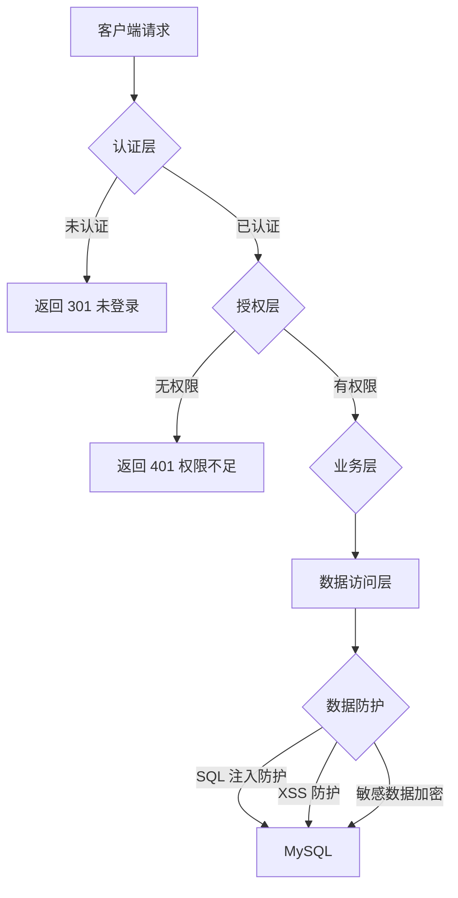
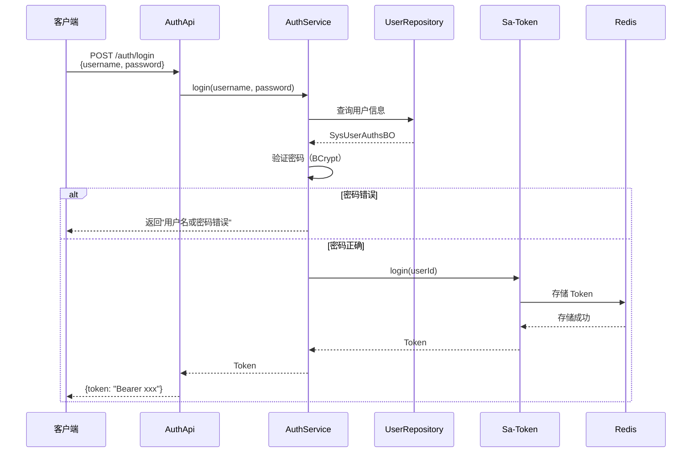
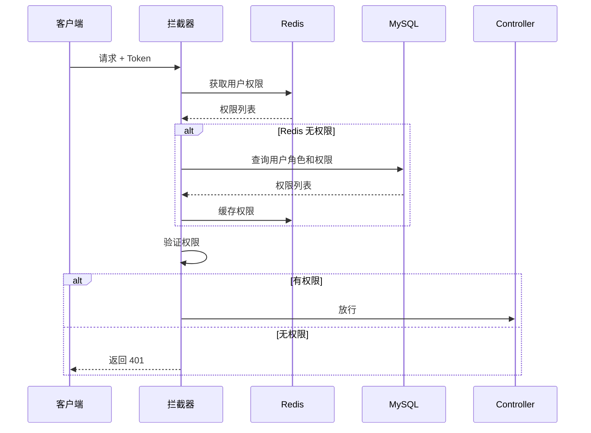

# 13-安全与权限控制

> 认证授权机制、敏感数据保护与防注入措施

---

## 13.1 安全架构概览



---

## 13.2 认证机制

### 13.2.1 认证框架：Sa-Token

**核心特性：**
- 轻量级，配置简单
- 支持 JWT、Session 多种模式
- 支持多端登录、Token 续签
- 集成 Redis 实现分布式会话

### 13.2.2 Token 配置

**配置位置：** `application.yml:74-99`

```yaml
sa-token:
  # JWT 秘钥（生产环境必须修改）
  jwt-secret-key: pxc-system-cloud
  
  # 请求 token 名称（同时也是 cookie 名称）
  token-name: Authorization
  
  # token 有效期（单位：秒）默认 2 小时
  timeout: 7200
  
  # token 最低活跃频率（单位：秒），如果 token 超过此时间没有访问系统就会被冻结
  active-timeout: -1  # 不限制
  
  # 是否允许同一账号多地同时登录
  is-concurrent: true
  
  # 在多人登录同一账号时，是否共用一个 token
  is-share: false
  
  # token 风格（random-64: 64 位随机字符串）
  token-style: random-64
  
  # 是否输出操作日志
  is-log: false
  
  # 是否从 header 里读取 token
  is-read-header: true
  
  # 是否从 cookie 里读取 token
  is-read-cookie: false
  
  # token 前缀
  token-prefix: Bearer
```

### 13.2.3 登录流程



### 13.2.4 登录接口示例

```java
@PostMapping("/login")
public R<LoginVO> login(@RequestBody LoginDTO loginDTO) {
    // 1. 查询用户凭证
    SysUserAuthsBO auths = userAuthsRepo.getByName(loginDTO.getUsername());
    
    // 2. 验证密码
    if (!passwordEncoder.matches(loginDTO.getPassword(), auths.getCredential())) {
        return R.fail("用户名或密码错误");
    }
    
    // 3. 执行登录
    StpUtil.login(auths.getUserId());
    
    // 4. 返回 Token
    String token = StpUtil.getTokenValue();
    return R.ok(new LoginVO(token));
}
```

### 13.2.5 登出流程

```java
@PostMapping("/logout")
public R<Void> logout() {
    // 1. 清除 Token
    StpUtil.logout();
    
    // 2. 从 Redis 删除 Token
    // Sa-Token 自动处理
    
    return R.ok();
}
```

---

## 13.3 授权机制

### 13.3.1 RBAC 权限模型

**三要素：**
- **用户 (User)**：系统操作主体
- **角色 (Role)**：权限集合
- **权限 (Permission)**：具体操作权限

**关系：**
```
用户 --N:M--> 角色 --N:M--> 权限（菜单/按钮）
```

### 13.3.2 数据权限

**5 种数据权限范围：**

| 值 | 说明 | SQL 示例 |
|----|------|---------|
| 1 | 全部数据 | 无限制 |
| 2 | 自定义数据 | `AND org_id IN (...)` |
| 3 | 本部门数据 | `AND org_id = current_org` |
| 4 | 本部门及以下 | `AND org_id IN (current_org 及子部门)` |
| 5 | 仅本人数据 | `AND create_by = current_user` |

### 13.3.3 权限注解使用

```java
// 检查角色
@SaCheckRole("admin")
@DeleteMapping("/delete")
public R<Void> delete(@RequestParam Integer id) {
    return sysUserAppService.deleteById(id);
}

// 检查权限
@SaCheckPermission("sys:user:add")
@PostMapping
public R<SysUserVO> save(@RequestBody SysUserCreateDTO dto) {
    return sysUserAppService.save(dto);
}

// 检查多个权限（满足任一）
@SaCheckPermissionOr("sys:user:add", "sys:user:edit")
@PutMapping
public R<Void> update(@RequestBody SysUserUpdateDTO dto) {
    return sysUserAppService.update(dto);
}
```

### 13.3.4 权限获取流程



---

## 13.4 密码安全

### 13.4.1 密码加密

**加密算法：** BCrypt

**加密示例：**
```java
// 加密密码
String encodedPassword = passwordEncoder.encode("123456");
// 输出：$2a$10$N.zmdr9k7uOCQb376NoUnuTJ8iAt6Z5EHsM8lE9lBOsl7iKTVKIUi

// 验证密码
boolean matches = passwordEncoder.matches("123456", encodedPassword);
// 输出：true
```

### 13.4.2 密码存储

**表：** `sys_user_auths`

| 字段 | 说明 |
|------|------|
| credential | 加密后的密码（BCrypt） |
| expire_at | 密码过期时间 |

### 13.4.3 默认密码

**配置：** 系统参数 `sys.user.password`

**首次登录强制修改：**
```java
if (user.getLoginNums() == 0) {
    // 首次登录，提示修改密码
    user.setMustChangePassword(true);
}
```

---

## 13.5 敏感数据保护

### 13.5.1 数据脱敏

**脱敏场景：**
- 手机号：`138****8000`
- 身份证：`320***19900101***`
- 邮箱：`z***@example.com`

**脱敏注解：**
```java
public class SysUserVO {
    
    @JsonFormat(pattern = "yyyy-MM-dd HH:mm:ss")
    private LocalDateTime loginAt;
    
    // 手机号脱敏
    @JsonSerialize(using = MobileMaskSerializer.class)
    private String mobile;
    
    // 身份证脱敏
    @JsonSerialize(using = IdCardMaskSerializer.class)
    private String idCard;
}
```

**脱敏工具类：**
```java
public class MaskUtil {
    
    /**
     * 手机号脱敏
     */
    public static String maskMobile(String mobile) {
        if (StringUtils.isBlank(mobile)) return mobile;
        return mobile.replaceAll("(\\d{3})\\d{4}(\\d{4})", "$1****$2");
    }
    
    /**
     * 身份证脱敏
     */
    public static String maskIdCard(String idCard) {
        if (StringUtils.isBlank(idCard)) return idCard;
        return idCard.replaceAll("(\\d{6})\\d{8}(\\w{4})", "$1********$2");
    }
}
```

### 13.5.2 敏感字段加密

**加密场景：**
- 身份证号码
- 银行卡号
- 联系方式

**加密方式：** AES-256

```java
@Service
public class SensitiveDataService {
    
    @Autowired
    private AesUtil aesUtil;
    
    /**
     * 保存敏感数据
     */
    public void save(SensitiveData data) {
        data.setIdCard(aesUtil.encrypt(data.getIdCard()));
        data.setMobile(aesUtil.encrypt(data.getMobile()));
        repository.save(data);
    }
    
    /**
     * 查询并解密
     */
    public SensitiveDataVO getById(Integer id) {
        SensitiveData data = repository.findById(id);
        SensitiveDataVO vo = convert(data);
        vo.setIdCard(aesUtil.decrypt(data.getIdCard()));
        vo.setMobile(aesUtil.decrypt(data.getMobile()));
        return vo;
    }
}
```

---

## 13.6 防注入措施

### 13.6.1 SQL 注入防护

**MyBatis-Plus 预编译：**

```java
// ✅ 安全：参数化查询
wrapper.eq(SysUserPO::getMobile, mobile);
wrapper.like(SysUserPO::getRealName, keyword);

// ❌ 危险：字符串拼接（避免）
wrapper.and(w -> w.apply("mobile = '" + mobile + "'"));
```

**XML 中防护：**
```xml
<!-- ✅ 安全 -->
<select id="selectByMobile" resultType="SysUserPO">
    SELECT * FROM sys_user WHERE mobile = #{mobile}
</select>

<!-- ❌ 危险 -->
<select id="selectByMobile" resultType="SysUserPO">
    SELECT * FROM sys_user WHERE mobile = '${mobile}'
</select>
```

### 13.6.2 XSS 防护

**配置：**
```yaml
pxc-framework-boot3:
  xss:
    enabled: true  # 开启 XSS 防护
```

**防护方式：**
1. **输入过滤**：去除 `<script>`, `javascript:` 等
2. **输出转义**：HTML 实体转义

**XSS 过滤器：**
```java
public class XssFilter implements Filter {
    
    @Override
    public void doFilter(ServletRequest request, ServletResponse response, FilterChain chain) {
        XssHttpServletRequestWrapper wrapper = new XssHttpServletRequestWrapper(
            (HttpServletRequest) request
        );
        chain.doFilter(wrapper, response);
    }
}

public class XssHttpServletRequestWrapper extends HttpServletRequestWrapper {
    
    @Override
    public String getParameter(String name) {
        String value = super.getParameter(name);
        return cleanXss(value);
    }
    
    private String cleanXss(String value) {
        if (value == null) return null;
        value = value.replaceAll("<", "&lt;").replaceAll(">", "&gt;");
        value = value.replaceAll("javascript", "");
        return value;
    }
}
```

### 13.6.3 CSRF 防护

**说明：** REST API 通常不启用 CSRF（使用 Token 认证）

**配置：**
```java
@Configuration
public class SecurityConfig {
    
    @Bean
    public SecurityFilterChain filterChain(HttpSecurity http) throws Exception {
        http.csrf().disable();  // REST API 禁用 CSRF
        return http.build();
    }
}
```

---

## 13.7 会话安全

### 13.7.1 Token 有效期

**配置：**
```yaml
sa-token:
  timeout: 7200        # Token 有效期 2 小时
  active-timeout: -1   # 不限制活跃频率
```

**推荐配置：**
| 场景 | 有效期 | 活跃频率 |
|------|--------|---------|
| PC 端 | 24 小时 | 30 分钟 |
| APP 端 | 7 天 | 1 小时 |
| 管理后台 | 2 小时 | 30 分钟 |

### 13.7.2 Token 续签

```java
/**
 * Token 续签
 */
@GetMapping("/renew")
public R<Void> renewToken() {
    // 续签 Token（刷新有效期）
    StpUtil.renewTimeout();
    return R.ok();
}
```

### 13.7.3 多端登录控制

**配置：**
```yaml
sa-token:
  is-concurrent: true   # 允许同一账号多地登录
  is-share: false       # 每次登录新建 Token
```

**强制下线：**
```java
/**
 * 强制用户下线
 */
@SaCheckPermission("sys:user:kickout")
@PostMapping("/kickout")
public R<Void> kickout(@RequestParam Integer userId) {
    StpUtil.kickout(userId);
    return R.ok();
}
```

---

## 13.8 审计日志

### 13.8.1 登录日志

**表：** `sys_log_login`

| 字段 | 说明 |
|------|------|
| user_id | 用户 ID |
| username | 用户名 |
| ip | 登录 IP |
| address | 登录地址 |
| browser | 浏览器 |
| os | 操作系统 |
| status | 登录状态 |
| message | 消息 |
| login_at | 登录时间 |

**记录时机：**
- 登录成功/失败
- 登出

### 13.8.2 操作日志

**表：** `sys_log_operate`

| 字段 | 说明 |
|------|------|
| module | 业务模块 |
| title | 操作标题 |
| method | 方法名 |
| request_method | 请求方式 |
| oper_name | 操作人 |
| oper_url | 操作 URL |
| oper_ip | 操作 IP |
| oper_param | 请求参数 |
| json_result | 返回数据 |
| status | 操作状态 |
| error_msg | 错误信息 |
| oper_time | 操作时间 |

**记录方式：** AOP 切面

```java
@Aspect
@Component
public class OperateLogAspect {
    
    @Around("@annotation(operateLog)")
    public Object around(ProceedingJoinPoint point, OperateLog operateLog) {
        long start = System.currentTimeMillis();
        try {
            Object result = point.proceed();
            saveLog(point, operateLog, result, null, true);
            return result;
        } catch (Exception e) {
            saveLog(point, operateLog, null, e.getMessage(), false);
            throw e;
        } finally {
            long cost = System.currentTimeMillis() - start;
        }
    }
}
```

---

## 13.9 安全检查清单

### 13.9.1 开发阶段

- [ ] 密码使用 BCrypt 加密
- [ ] SQL 使用参数化查询
- [ ] 敏感数据脱敏展示
- [ ] 接口添加权限注解
- [ ] Token 有效期合理

### 13.9.2 测试阶段

- [ ] 未登录访问被拦截
- [ ] 无权限访问被拒绝
- [ ] SQL 注入测试通过
- [ ] XSS 攻击测试通过
- [ ] Token 过期正确处理

### 13.9.3 生产阶段

- [ ] JWT 秘钥已修改
- [ ] 数据库密码已加密
- [ ] Redis 已设置密码
- [ ] HTTPS 已启用
- [ ] 日志已脱敏

---

## 13.10 安全加固建议

### 13.10.1 认证加固

1. **密码策略**：
   - 最小长度 8 位
   - 包含大小写字母、数字、特殊字符
   - 定期更换（90 天）

2. **登录限制**：
   - 连续失败 5 次锁定 30 分钟
   - 验证码防护
   - IP 限流

### 13.10.2 传输安全

1. **HTTPS**：生产环境强制 HTTPS
2. **Token 加密**：使用 TLS 1.3
3. **敏感字段**：端到端加密

### 13.10.3 存储安全

1. **数据库加密**：敏感字段 AES 加密
2. **密钥管理**：使用密钥管理服务
3. **备份加密**：数据库备份加密存储

---

## 13.11 参考文档

- [Sa-Token 安全文档](https://sa-token.cc/doc.html)
- [OWASP Top 10](https://owasp.org/www-project-top-ten/)
- [Spring Security](https://spring.io/projects/spring-security)
