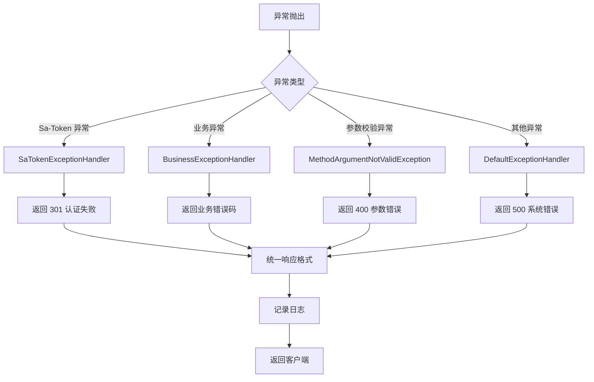

# 15-异常处理与可观测性

> 错误码规范、日志追踪与监控告警

---

## 15.1 异常处理架构

### 15.1.1 全局异常处理

**处理流程：**



### 15.1.2 异常分类

| 异常类型 | 来源 | 处理类 | 返回码 |
|---------|------|--------|--------|
| NotLoginException | Sa-Token | SaTokenExceptionHandler | 301 |
| NotRoleException | Sa-Token | SaTokenExceptionHandler | 401 |
| NotPermissionException | Sa-Token | SaTokenExceptionHandler | 401 |
| BusinessException | 业务代码 | BusinessExceptionHandler | 500 |
| MethodArgumentNotValidException | Spring | GlobalExceptionHandler | 400 |
| Exception | 系统 | GlobalExceptionHandler | 500 |

---

## 15.2 异常处理器

### 2.1 Sa-Token 异常处理

**代码位置：** `SaTokenExceptionHandler.java:18-48`

```java
@RestControllerAdvice
public class SaTokenExceptionHandler {
    
    /**
     * 权限码异常
     */
    @ExceptionHandler(NotPermissionException.class)
    public R<Void> handleNotPermissionException(NotPermissionException e, HttpServletRequest request) {
        log.error("请求地址：{},权限码校验失败：{}", request.getRequestURI(), e.getMessage());
        return R.fail(CommonResponseEnum.FORBIDDEN.getCode(), "没有访问权限，请联系管理员授权");
    }
    
    /**
     * 角色权限异常
     */
    @ExceptionHandler(NotRoleException.class)
    public R<Void> handleNotRoleException(NotRoleException e, HttpServletRequest request) {
        log.error("请求地址：{},角色权限校验失败：{}", request.getRequestURI(), e.getMessage());
        return R.fail(CommonResponseEnum.FORBIDDEN.getCode(), "没有访问权限，请联系管理员授权");
    }
    
    /**
     * 认证失败
     */
    @ExceptionHandler(NotLoginException.class)
    public R<Void> handleNotLoginException(NotLoginException e, HttpServletRequest request) {
        log.error("请求地址：{},认证失败：{},无法访问系统资源", request.getRequestURI(), e.getMessage());
        return R.fail(CommonResponseEnum.FORBIDDEN.getCode(), "认证失败，无法访问系统资源");
    }
}
```

### 15.2.2 业务异常处理

```java
@RestControllerAdvice
@Slf4j
public class BusinessExceptionHandler {
    
    /**
     * 业务异常
     */
    @ExceptionHandler(BusinessException.class)
    public R<Void> handleBusinessException(BusinessException e, HttpServletRequest request) {
        log.error("请求地址：{},业务异常：{}", request.getRequestURI(), e.getMessage());
        return R.fail(e.getCode(), e.getMessage());
    }
    
    /**
     * 参数校验异常
     */
    @ExceptionHandler(MethodArgumentNotValidException.class)
    public R<Void> handleValidationException(MethodArgumentNotValidException e, HttpServletRequest request) {
        String message = e.getBindingResult().getAllErrors().get(0).getDefaultMessage();
        log.warn("请求地址：{},参数校验失败：{}", request.getRequestURI(), message);
        return R.fail(400, message);
    }
    
    /**
     * 系统异常
     */
    @ExceptionHandler(Exception.class)
    public R<Void> handleException(Exception e, HttpServletRequest request) {
        log.error("请求地址：{},系统异常：{}", request.getRequestURI(), e.getMessage(), e);
        return R.fail(500, "系统繁忙，请稍后重试");
    }
}
```

---

## 15.3 错误码规范

### 15.3.1 错误码定义

| 错误码 | 说明 | 场景 |
|--------|------|------|
| 0 | 成功 | 正常响应 |
| 301 | 未登录 | Token 无效/过期 |
| 400 | 参数错误 | 参数校验失败 |
| 401 | 无权限 | 角色/权限不足 |
| 403 | 禁止访问 | 资源被禁止 |
| 404 | 资源不存在 | ID 不存在 |
| 500 | 系统错误 | 系统异常 |
| 1001 | 登录账号已存在 | 用户创建 |
| 1002 | 用户不存在 | 用户查询 |
| 1003 | 密码错误 | 用户登录 |
| 2001 | 角色已被引用 | 角色删除 |
| 2002 | 菜单已被引用 | 菜单删除 |

### 15.3.2 错误码枚举

```java
public enum CommonResponseEnum {
    
    SUCCESS(0, "success"),
    FORBIDDEN(301, "认证失败，无法访问系统资源"),
    BAD_REQUEST(400, "参数错误"),
    UNAUTHORIZED(401, "无权限访问"),
    NOT_FOUND(404, "资源不存在"),
    INTERNAL_ERROR(500, "系统繁忙，请稍后重试");
    
    private final Integer code;
    private final String msg;
    
    CommonResponseEnum(Integer code, String msg) {
        this.code = code;
        this.msg = msg;
    }
    
    public Integer getCode() { return code; }
    public String getMsg() { return msg; }
}
```

---

## 15.4 日志规范

### 15.4.1 日志级别

| 级别 | 使用场景 |
|------|---------|
| **ERROR** | 系统错误、异常堆栈 |
| **WARN** | 警告信息、业务异常 |
| **INFO** | 关键业务流程、操作日志 |
| **DEBUG** | 调试信息、详细参数 |
| **TRACE** | 详细追踪信息 |

### 15.4.2 日志格式

**配置：** `logback-spring.xml`

```xml
<configuration>
    <!-- 控制台输出 -->
    <appender name="CONSOLE" class="ch.qos.logback.core.ConsoleAppender">
        <encoder>
            <pattern>%d{yyyy-MM-dd HH:mm:ss.SSS} [%thread] %-5level %logger{36} - %msg%n</pattern>
        </encoder>
    </appender>
    
    <!-- 文件输出 -->
    <appender name="FILE" class="ch.qos.logback.core.rolling.RollingFileAppender">
        <file>logs/project-system/info.log</file>
        <rollingPolicy class="ch.qos.logback.core.rolling.TimeBasedRollingPolicy">
            <fileNamePattern>logs/project-system/info.%d{yyyy-MM-dd}.log</fileNamePattern>
            <maxHistory>30</maxHistory>
        </rollingPolicy>
        <encoder>
            <pattern>%d{yyyy-MM-dd HH:mm:ss.SSS} [%thread] %-5level %logger{36} - %msg%n</pattern>
        </encoder>
    </appender>
    
    <!-- 错误日志 -->
    <appender name="ERROR_FILE" class="ch.qos.logback.core.rolling.RollingFileAppender">
        <file>logs/project-system/error.log</file>
        <filter class="ch.qos.logback.classic.filter.LevelFilter">
            <level>ERROR</level>
            <onMatch>ACCEPT</onMatch>
            <onMismatch>DENY</onMismatch>
        </filter>
        <rollingPolicy class="ch.qos.logback.core.rolling.TimeBasedRollingPolicy">
            <fileNamePattern>logs/project-system/error.%d{yyyy-MM-dd}.log</fileNamePattern>
            <maxHistory>30</maxHistory>
        </rollingPolicy>
        <encoder>
            <pattern>%d{yyyy-MM-dd HH:mm:ss.SSS} [%thread] %-5level %logger{36} - %msg%n</pattern>
        </encoder>
    </appender>
    
    <root level="INFO">
        <appender-ref ref="CONSOLE"/>
        <appender-ref ref="FILE"/>
        <appender-ref ref="ERROR_FILE"/>
    </root>
    
    <!-- 业务日志级别 -->
    <logger name="io.github.panxiaochao.project" level="INFO"/>
</configuration>
```

### 15.4.3 日志使用示例

```java
@Slf4j
@Service
public class SysUserAppService {
    
    /**
     * 保存用户
     */
    public R<SysUserVO> save(SysUserCreateDTO dto) {
        log.info("开始创建用户，loginName: {}", dto.getLoginName());
        
        try {
            // 业务逻辑
            SysUserBO user = sysUserService.save(sysUser);
            log.info("用户创建成功，userId: {}", user.getId());
            
            return R.ok(convertToVO(user));
            
        } catch (BusinessException e) {
            log.warn("用户创建失败：{}", e.getMessage());
            return R.fail(e.getCode(), e.getMessage());
            
        } catch (Exception e) {
            log.error("用户创建异常，dto: {}", dto, e);
            return R.fail(500, "系统繁忙");
        }
    }
}
```

---

## 15.5 日志追踪

### 15.5.1 TraceID 实现

**使用 MDC 实现链路追踪：**

```java
@Component
public class TraceFilter implements Filter {
    
    private static final String TRACE_ID_KEY = "traceId";
    
    @Override
    public void doFilter(ServletRequest request, ServletResponse response, FilterChain chain)
            throws IOException, ServletException {
        
        String traceId = UUID.randomUUID().toString().replace("-", "").substring(0, 16);
        
        try {
            // 设置 TraceID
            MDC.put(TRACE_ID_KEY, traceId);
            
            // 继续执行
            chain.doFilter(request, response);
            
        } finally {
            // 清理 MDC
            MDC.clear();
        }
    }
}
```

**日志配置：**

```xml
<pattern>%d{yyyy-MM-dd HH:mm:ss.SSS} [%thread] [%X{traceId}] %-5level %logger{36} - %msg%n</pattern>
```

**日志输出：**

```
2026-04-21 10:30:45.123 [http-nio-8081-exec-1] [a1b2c3d4e5f6] INFO  c.p.s.SysUserAppService - 开始创建用户，loginName: zhangsan
2026-04-21 10:30:45.456 [http-nio-8081-exec-1] [a1b2c3d4e5f6] INFO  c.p.s.SysUserAppService - 用户创建成功，userId: 100
```

---

## 15.6 监控指标

### 15.6.1 应用监控

**使用 Spring Boot Actuator：**

```xml
<dependency>
    <groupId>org.springframework.boot</groupId>
    <artifactId>spring-boot-starter-actuator</artifactId>
</dependency>
```

**配置：**

```yaml
management:
  endpoints:
    web:
      exposure:
        include: health,info,metrics,prometheus
  endpoint:
    health:
      show-details: always
  metrics:
    export:
      prometheus:
        enabled: true
```

**访问地址：**
- 健康检查：`http://localhost:8081/actuator/health`
- 指标数据：`http://localhost:8081/actuator/metrics`
- Prometheus: `http://localhost:8081/actuator/prometheus`

### 15.6.2 关键指标

| 指标 | 说明 | 告警阈值 |
|------|------|---------|
| jvm.memory.used | JVM 堆内存使用 | > 85% |
| jvm.gc.pause | GC 暂停时间 | > 1s |
| http.server.requests | HTTP 请求延迟 | P99 > 1s |
| tomcat.threads.busy | 线程池占用 | > 80% |
| logback.events | 日志事件数 | ERROR > 100/min |

---

## 15.7 告警规则

### 15.7.1 应用层告警

| 指标 | 警告阈值 | 严重阈值 | 通知方式 |
|------|---------|---------|---------|
| 错误率 | > 1% | > 5% | 邮件/钉钉 |
| 响应时间 P99 | > 1s | > 3s | 邮件 |
| CPU 使用率 | > 70% | > 85% | 钉钉 |
| 内存使用率 | > 80% | > 90% | 钉钉 |
| JVM GC 频率 | > 10/min | > 30/min | 邮件 |

### 15.7.2 数据库告警

| 指标 | 警告阈值 | 严重阈值 |
|------|---------|---------|
| 慢查询数 | > 10/min | > 50/min |
| 连接数使用率 | > 70% | > 90% |
| 死锁次数 | > 1/hour | > 5/hour |

### 15.7.3 Redis 告警

| 指标 | 警告阈值 | 严重阈值 |
|------|---------|---------|
| 内存使用率 | > 70% | > 85% |
| 命中率 | < 80% | < 60% |
| 连接数 | > 100 | > 200 |

---

## 15.8 可观测性实践

### 15.8.1 链路追踪

**集成 SkyWalking：**

```yaml
# Docker 启动
docker run -d \
  --name skywalking-oap \
  -e SW_STORAGE=hs \
  apache/skywalking-oap-server
  
docker run -d \
  --name skywalking-ui \
  -p 8080:8080 \
  apache/skywalking-ui
```

**Java Agent 挂载：**

```bash
java -javaagent:/path/to/skywalking-agent.jar \
     -Dskywalking.agent.service_name=project-system \
     -Dskywalking.collector.backend_service=oap:11800 \
     -jar app.jar
```

### 15.8.2 日志聚合

**ELK Stack：**

```yaml
# docker-compose.yml
version: '3'
services:
  elasticsearch:
    image: docker.elastic.co/elasticsearch/elasticsearch:8.0.0
    
  logstash:
    image: docker.elastic.co/logstash/logstash:8.0.0
    
  kibana:
    image: docker.elastic.co/kibana/kibana:8.0.0
    ports:
      - "5601:5601"
```

---

## 15.9 最佳实践

### 15.9.1 异常处理

1. **统一异常封装**：使用业务异常类
2. **避免吞掉异常**：必须记录日志
3. **敏感信息脱敏**：不记录密码等敏感信息
4. **友好错误提示**：不暴露内部细节

### 15.9.2 日志规范

1. **级别合理**：ERROR 用于异常，INFO 用于关键流程
2. **参数脱敏**：手机号、身份证等脱敏
3. **避免大日志**：不打印大对象
4. **异步日志**：高并发时使用异步日志

### 15.9.3 监控告警

1. **分级告警**：警告/严重不同通知方式
2. **告警收敛**：避免告警风暴
3. **定期复盘**：分析告警原因
4. **自动恢复**：可自愈的自动处理

---

## 15.10 参考文档

- [Spring Boot Actuator](https://docs.spring.io/spring-boot/docs/current/reference/html/actuator.html)
- [Logback Manual](http://logback.qos.ch/manual/)
- [SkyWalking Documentation](https://skywalking.apache.org/docs)
