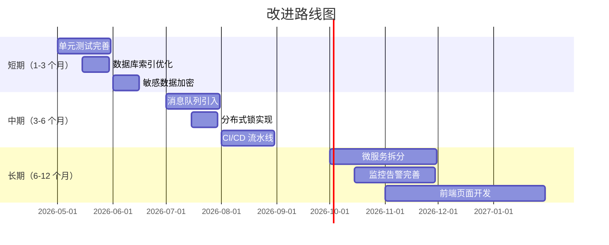

# 18-演进路标与技术债

> 待优化项、版本规划与已知遗留问题

---

## 18.1 当前版本状态

**版本：** 3.0.1-SNAPSHOT  
**框架：** Spring Boot 3.5.11  
**JDK：** 17  
**更新日期：** 2026-04-21

---

## 18.2 待优化项清单

### 18.2.1 高优先级（P0）

| 序号 | 优化项 | 说明 | 预计工时 | 负责人 |
|------|--------|------|---------|--------|
| 1 | 完善单元测试 | 当前覆盖率不足 50%，目标 70%+ | 40h | - |
| 2 | 集成测试补充 | 核心业务流程集成测试 | 24h | - |
| 3 | 数据库索引优化 | 添加缺失索引，优化慢查询 | 16h | - |
| 4 | 敏感数据加密 | 身份证、手机号等加密存储 | 16h | - |
| 5 | API 限流防护 | 防止接口滥用 | 8h | - |

### 18.2.2 中优先级（P1）

| 序号 | 优化项 | 说明 | 预计工时 | 负责人 |
|------|--------|------|---------|--------|
| 1 | 引入消息队列 | RabbitMQ/Kafka异步解耦 | 40h | - |
| 2 | 分布式锁实现 | Redisson 实现分布式锁 | 16h | - |
| 3 | 接口幂等性设计 | 防止重复提交 | 16h | - |
| 4 | 缓存穿透防护 | 布隆过滤器/空值缓存 | 8h | - |
| 5 | 日志脱敏增强 | 手机号、身份证自动脱敏 | 8h | - |
| 6 | Docker 容器化 | 完善 Dockerfile 和 K8s 配置 | 16h | - |
| 7 | CI/CD 流水线 | GitHub Actions 自动化部署 | 16h | - |

### 18.2.3 低优先级（P2）

| 序号 | 优化项 | 说明 | 预计工时 | 负责人 |
|------|--------|------|---------|--------|
| 1 | 代码生成器增强 | 支持更多模板和配置 | 24h | - |
| 2 | 前端页面开发 | 配套 Vue/React 前端 | 80h | - |
| 3 | 多语言支持 | i18n 国际化 | 16h | - |
| 4 | 数据导入导出 | Excel 导入导出功能 | 16h | - |
| 5 | 操作审计增强 | 更详细的操作日志 | 8h | - |
| 6 | 性能监控完善 | SkyWalking/APM集成 | 16h | - |

---

## 18.3 技术债

### 18.3.1 代码质量

| 序号 | 问题描述 | 影响 | 建议方案 |
|------|---------|------|---------|
| 1 | 缺少单元测试 | 回归测试成本高 | 补充核心业务单元测试 |
| 2 | 部分方法过长 | 代码可读性差 | 提取小方法，遵循单一职责 |
| 3 | 重复代码较多 | 维护成本高 | 抽取公共方法/工具类 |
| 4 | 注释不足 | 理解成本高 | 补充关键方法 JavaDoc |

### 18.3.2 架构设计

| 序号 | 问题描述 | 影响 | 建议方案 |
|------|---------|------|---------|
| 1 | 未使用消息队列 | 同步阻塞，耦合度高 | 引入 RabbitMQ 异步解耦 |
| 2 | 缓存策略不完善 | 数据库压力大 | 完善多级缓存策略 |
| 3 | 缺少限流熔断 | 系统稳定性风险 | 引入 Sentinel/Resilience4j |
| 4 | 未实现分布式锁 | 并发安全问题 | 使用 Redisson 分布式锁 |

### 18.3.3 数据安全

| 序号 | 问题描述 | 影响 | 建议方案 |
|------|---------|------|---------|
| 1 | JWT 秘钥硬编码 | 安全风险 | 使用环境变量/配置中心 |
| 2 | 密码未强制轮换 | 安全风险 | 实现密码定期轮换策略 |
| 3 | 敏感数据明文存储 | 数据泄露风险 | AES 加密存储敏感字段 |
| 4 | 缺少操作审计 | 无法追溯 | 完善操作日志记录 |

### 18.3.4 性能优化

| 序号 | 问题描述 | 影响 | 建议方案 |
|------|---------|------|---------|
| 1 | 缺少数据库索引 | 查询性能差 | 分析慢查询，添加索引 |
| 2 | N+1 查询问题 | 数据库压力大 | 使用联表查询/批量查询 |
| 3 | 未使用连接池预热 | 启动慢 | 配置连接池预热 |
| 4 | 缺少分页限制 | 大数据量风险 | 限制最大页大小 |

---

## 18.4 版本规划

### 18.4.1 v3.0.2（下一个版本）

**发布日期：** 待定  
**重点：** 稳定性与安全性

**功能清单：**
- [ ] 完善单元测试和集成测试
- [ ] 添加数据库索引优化
- [ ] 敏感数据加密存储
- [ ] API 限流防护
- [ ] 日志脱敏增强

### 18.4.2 v3.1.0（功能增强）

**发布日期：** 待定  
**重点：** 功能扩展

**功能清单：**
- [ ] 引入消息队列
- [ ] 分布式锁实现
- [ ] 接口幂等性设计
- [ ] 数据导入导出
- [ ] 多语言支持

### 18.4.3 v4.0.0（架构升级）

**发布日期：** 待定  
**重点：** 架构重构

**功能清单：**
- [ ] 微服务拆分（用户服务、权限服务等）
- [ ] 服务注册与发现（Nacos）
- [ ] 配置中心集成
- [ ] 网关统一入口（Spring Cloud Gateway）
- [ ] 链路追踪集成（SkyWalking）

---

## 18.5 已知问题

### 18.5.1 功能缺陷

| 序号 | 问题描述 | 影响范围 | 临时方案 | 修复计划 |
|------|---------|---------|---------|---------|
| 1 | 用户删除后缓存未清除 | 可能查到已删除用户 | 手动清除缓存 | v3.0.2 |
| 2 | 字典缓存未实时更新 | 字典修改后需重启 | 手动刷新缓存 | v3.0.2 |
| 3 | 分页查询深度性能差 | offset>10000 慢 | 限制最大页码 | v3.0.2 |

### 18.5.2 性能问题

| 序号 | 问题描述 | 影响范围 | 临时方案 | 修复计划 |
|------|---------|---------|---------|---------|
| 1 | 用户列表查询慢 | 数据量大时 | 添加索引 | v3.0.2 |
| 2 | 菜单树查询频繁 | 每次请求都查 | 缓存菜单树 | v3.0.2 |
| 3 | 日志表增长快 | 磁盘空间占用 | 定期清理 | v3.1.0 |

### 18.5.3 兼容性问题

| 序号 | 问题描述 | 影响范围 | 临时方案 | 修复计划 |
|------|---------|---------|---------|---------|
| 1 | MySQL 9.x 兼容 | 部分 SQL 语法 | 调整 SQL | 已解决 |
| 2 | JDK 17 兼容性 | Record 类使用 | 保持现状 | - |

---

## 18.6 技术选型建议

### 18.6.1 短期建议（3-6 个月）

1. **完善测试体系**
   - 单元测试覆盖率提升至 70%
   - 核心业务流程集成测试
   - 性能基准测试

2. **安全性加固**
   - 敏感数据加密
   - API 限流防护
   - 操作审计完善

3. **性能优化**
   - 数据库索引优化
   - 缓存策略完善
   - 慢查询治理

### 18.6.2 中期建议（6-12 个月）

1. **架构升级**
   - 引入消息队列
   - 分布式锁实现
   - 熔断降级机制

2. **DevOps 建设**
   - Docker 容器化
   - CI/CD 流水线
   - 监控告警完善

3. **功能扩展**
   - 前端页面开发
   - 数据导入导出
   - 多语言支持

### 18.6.3 长期建议（12 个月+）

1. **微服务化**
   - 服务拆分
   - 服务治理
   - 分布式事务

2. **云原生**
   - K8s 部署
   - Service Mesh
   - Serverless

3. **数据驱动**
   - 大数据分析
   - 智能推荐
   - 数据可视化

---

## 18.7 改进路线图

---

## 18.8 团队建议

### 18.8.1 开发规范

1. **代码规范**
   - 遵循 Spring Java Format
   - 统一命名规范
   - 必要的注释和文档

2. **提交规范**
   - Commit message 规范
   - PR 模板
   - Code Review 流程

3. **测试规范**
   - 核心业务必须单元测试
   - 新增代码覆盖率达到 70%
   - 定期运行性能测试

### 18.8.2 技术分享

1. **定期分享**
   - 双周技术分享会
   - 最佳实践总结
   - 问题复盘

2. **知识沉淀**
   - 技术文档完善
   - 常见问题 FAQ
   - 最佳实践手册

---

## 18.9 参考资源

- [Spring Boot 官方文档](https://spring.io/projects/spring-boot)
- [DDD 领域驱动设计](https://martinfowler.com/bliki/DomainDrivenDesign.html)
- [微服务架构设计](https://microservices.io)
- [DevOps 实践指南](https://www.devops.com)

---

## 18.10 文档维护

**维护者：** Lypxc  
**最后更新：** 2026-04-21  
**更新频率：** 每月更新

**更新记录：**
- 2026-04-21：初始版本，完成全部 19 篇文档
